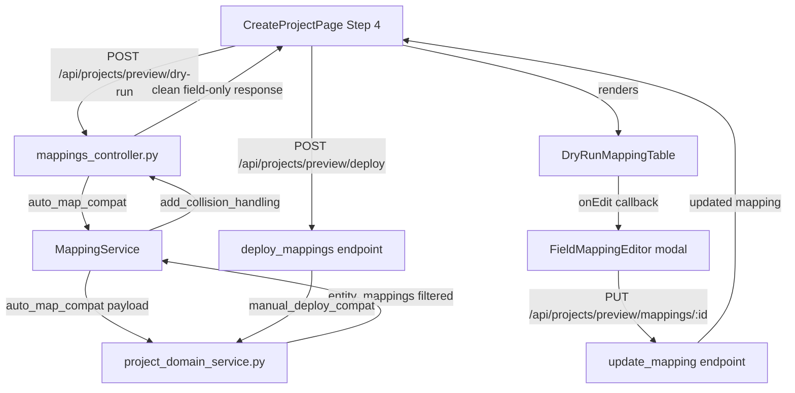
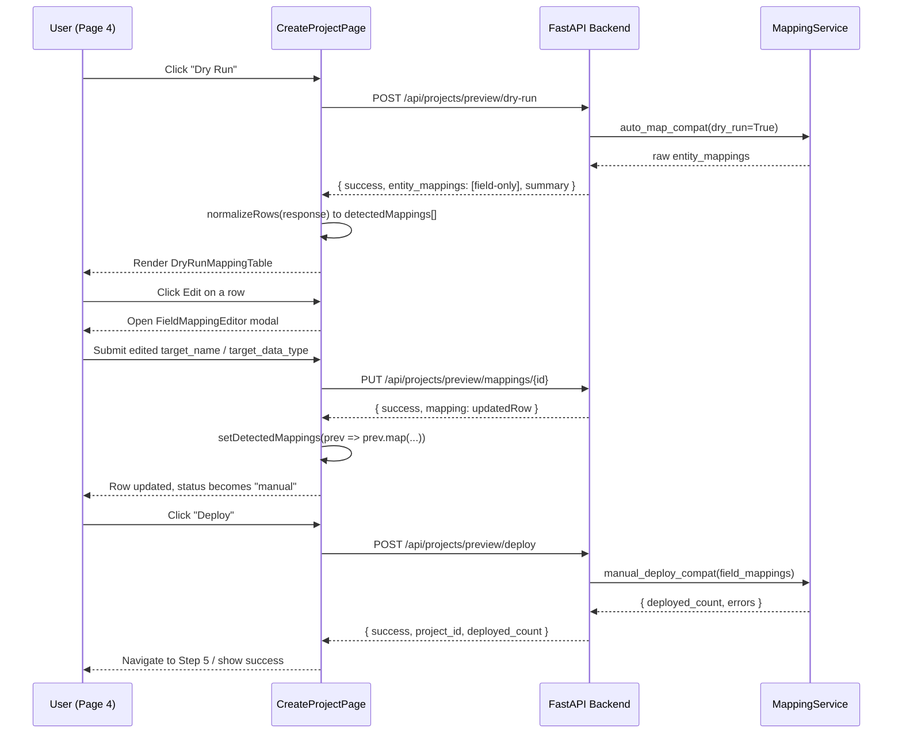

# Design Document: Page 4 Dry Run Enhancement

## Overview

The Page 4 Dry Run Enhancement improves the project creation wizard Mapping Options step (Step 4) in the semabridge frontend. Currently, the dry-run endpoint returns a full response including creation keys and deployment artifacts that confuse users. This feature cleans up the dry-run response to return only field-level mappings (columns and measures), then surfaces those mappings in an editable table on Page 4 so users can review, rename, and retype fields before deploying.

The backend already has a working POST /api/projects/{project_id}/dry-run endpoint in mappings_controller.py that filters to entity_kind of field, column, or measure. The frontend CreateProjectPage.jsx has state variables (detectedMappings, mappingDryRunStatus, etc.) and a normalizeRows() utility that can consume the clean response. The gap is the UI layer: there is no DryRunMappingTable component, no inline edit modal, and no wired-up deploy button on Step 4.

---

## Architecture



### Sequence: Dry Run to Edit to Deploy



---

## Components and Interfaces

### Component 1: DryRunMappingTable

**Purpose**: Renders the field-level mapping results from a dry run as a sortable, filterable, editable table.

**Location**: `frontend/src/components/DryRunMappingTable.jsx` (new file)

**Interface**:
```typescript
interface DryRunMappingTableProps {
  mappings: NormalizedRow[];
  onEdit: (rowId: string, updates: FieldUpdate) => void;
  onDeploy: () => void;
  isDeploying: boolean;
  summary: DryRunSummary;
}
```

**Responsibilities**:
- Display source name, source type, target name, target type, mapping status, and action column
- Render status badges: auto, manual, unmapped, collision
- Provide per-row Edit / Map button that opens FieldMappingEditor
- Show summary bar: "42 fields — 35 auto, 5 unmapped, 2 collisions"
- Render filter tabs (All / Auto / Manual / Unmapped / Collision) using existing MAPPING_FILTERS constant
- Enable Deploy button only when no blocking rows remain (no collision status)
- Support search/filter via existing SmartSearchBar component

### Component 2: FieldMappingEditor

**Purpose**: Modal for editing a single field mapping target name and data type.

**Location**: `frontend/src/components/FieldMappingEditor.jsx` (new file)

**Interface**:
```typescript
interface FieldMappingEditorProps {
  row: NormalizedRow | null;
  onSave: (rowId: string, updates: FieldUpdate) => void;
  onClose: () => void;
  targetPlatform: string;
  isSaving: boolean;
}

interface FieldUpdate {
  target_name: string;
  target_data_type: string;
}
```

**Responsibilities**:
- Show read-only source info (source_name, source_table, source_type)
- Provide editable target_name input with real-time validation via existing validateTargetName()
- Provide editable target_data_type select/input
- Show validation error inline (reserved keyword, unsupported chars, incompatible type)
- Call onSave with { target_name, target_data_type } on submit
- Reuse existing Modal component from frontend/src/components/common/Modal.jsx

### Component 3: CreateProjectPage Step 4 Enhancements

**Purpose**: Wire up dry-run trigger, mapping table display, and deploy flow within the existing Step 4 render block.

**Location**: `frontend/src/pages/CreateProjectPage.jsx` (existing file, Step 4 section)

**New state**:
```javascript
const [dryRunData, setDryRunData] = useState(null);
const [editingRow, setEditingRow] = useState(null);
const [isSavingEdit, setIsSavingEdit] = useState(false);
const [isDeploying, setIsDeploying] = useState(false);
const [deployError, setDeployError] = useState('');
```

---

## Data Models

### NormalizedRow (frontend)

Produced by the existing normalizeRows() function in CreateProjectPage.jsx. No changes needed to the shape.

```typescript
interface NormalizedRow {
  id: string;
  source_field: string;
  source_path: string;
  entity_kind: string;
  source_type: string;
  field_type: "column" | "measure";
  source_table_name: string;
  measure_source_tables: string[];
  measure_expression: string;
  target_field: string;
  target_type: string;
  status: "auto" | "manual" | "unmapped" | "collision";
  validation_status: string;
  validation_code: string;
  validation_message: string;
  suggested_target_name: string;
  collision_detected: boolean;
  isDirty: boolean;
}
```

### DryRunSummary

```typescript
interface DryRunSummary {
  total_fields: number;
  auto_mapped: number;
  unmapped: number;
  collisions: number;
}
```

### DryRunResponse (backend)

```typescript
interface DryRunResponse {
  success: boolean;
  entity_mappings: EntityMapping[];
  summary: DryRunSummary;
}

interface EntityMapping {
  id: string;
  entity_kind: "field" | "column" | "measure";
  source_name: string;
  source_data_type: string;
  source_table: string;
  source_path: string;
  source_qualified_path: string;
  target_name: string;
  target_data_type: string;
  mapping_status: "auto" | "manual" | "unmapped" | "collision";
  status: "auto" | "manual" | "unmapped" | "collision";
  suggested_target_name?: string;
}
```

### UpdateMappingRequest (backend extension)

The existing model in mappings_controller.py needs target_data_type added:

```python
class UpdateMappingRequest(BaseModel):
    target_name: str
    target_data_type: Optional[str] = None
    status: Optional[str] = "manual"
```

---

## Algorithmic Pseudocode

### Main Dry Run Flow

```pascal
PROCEDURE handleDryRun()
  INPUT: none (reads from component state)
  OUTPUT: side effects on detectedMappings, mappingDryRunStatus

  SEQUENCE
    setMappingDryRunStatus("loading")
    setMappingError("")

    sourceConfig <- buildSourceConfig(sourceConnector, fabricWorkspaceId, ...)
    targetConfig <- buildTargetConfig(targetConnectors, targetDatabase, ...)
    selectedSources <- Array.from(selectedModels).map(key -> selectedModelNameByKey[key])

    TRY
      response <- AWAIT api.runProjectDryRun("preview", {
        source_config: sourceConfig,
        target_config: targetConfig,
        selected_sources: selectedSources
      })

      IF response.success = false THEN
        setMappingError(response.error OR "Dry run failed")
        setMappingDryRunStatus("error")
        RETURN
      END IF

      rows <- normalizeRows(response)
      setDetectedMappings(rows)
      setDryRunData(response)
      setMappingDryRunStatus("success")

    CATCH error
      setMappingError(error.message)
      setMappingDryRunStatus("error")
    END TRY
  END SEQUENCE
END PROCEDURE
```

**Preconditions:**
- selectedModels is non-empty
- sourceConnector is set
- targetConnectors has at least one entry

**Postconditions:**
- mappingDryRunStatus is one of "loading", "success", "error"
- On success: detectedMappings contains normalized rows from the response
- On error: mappingError contains a human-readable message

---

### Field Edit Flow

```pascal
PROCEDURE handleFieldEdit(rowId, updates)
  INPUT: rowId: string, updates: { target_name, target_data_type }
  OUTPUT: side effects on detectedMappings row, closes editor

  SEQUENCE
    setIsSavingEdit(true)

    validation <- validateTargetName(
      updates.target_name,
      targetPlatform,
      sourceType,
      updates.target_data_type
    )

    IF validation.isValid = false THEN
      setIsSavingEdit(false)
      RETURN  // error shown inline in modal
    END IF

    TRY
      result <- AWAIT api.updateMapping("preview", rowId, {
        target_name: updates.target_name,
        target_data_type: updates.target_data_type,
        status: "manual"
      })

      setDetectedMappings(prev ->
        prev.map(row ->
          IF row.id = rowId THEN
            { ...row,
              target_field: updates.target_name,
              target_type: updates.target_data_type,
              status: "manual",
              isDirty: true }
          ELSE row
          END IF
        )
      )
      setEditingRow(null)

    CATCH error
      setMappingError(error.message)
    END TRY

    setIsSavingEdit(false)
  END SEQUENCE
END PROCEDURE
```

**Preconditions:**
- rowId matches an existing row in detectedMappings
- updates.target_name is a non-empty string

**Postconditions:**
- On success: matching row has status = "manual" and isDirty = true
- editingRow is set to null (modal closed)
- On validation failure: modal stays open, error shown inline

**Loop Invariants:**
- The map() over detectedMappings preserves all rows; only the matching row is mutated

---

### Deploy Flow

```pascal
PROCEDURE handleDeploy()
  INPUT: none (reads detectedMappings from state)
  OUTPUT: side effects on step, createdProject

  SEQUENCE
    blockingRows <- detectedMappings.filter(row -> isBlockingRow(row))

    IF blockingRows.length > 0 THEN
      setDeployError("Resolve all collisions before deploying.")
      RETURN
    END IF

    setIsDeploying(true)
    setDeployError("")

    fieldMappings <- detectedMappings.map(row -> {
      id: row.id,
      source_name: row.source_field,
      target_name: row.target_field,
      target_data_type: row.target_type,
      status: row.status,
      entity_kind: row.entity_kind
    })

    TRY
      result <- AWAIT api.deployMappings("preview", fieldMappings)

      IF result.success THEN
        setCreatedProject({ id: result.project_id })
        setStep(5)
      ELSE
        setDeployError("Deploy failed: " + (result.errors[0] OR "unknown error"))
      END IF

    CATCH error
      setDeployError(error.message)
    END TRY

    setIsDeploying(false)
  END SEQUENCE
END PROCEDURE
```

**Preconditions:**
- detectedMappings is non-empty (dry run has been run)
- No rows have status = "collision" (enforced by guard at top)

**Postconditions:**
- On success: step advances to 5, createdProject.id is set
- On error: deployError contains a human-readable message
- isDeploying returns to false in all cases

**Loop Invariants:**
- The map() over detectedMappings produces one output entry per input row

---

## Key Functions with Formal Specifications

### normalizeRows(data) — existing, no changes needed

```javascript
function normalizeRows(data: DryRunResponse): NormalizedRow[]
```

**Preconditions:**
- data is a valid DryRunResponse object (or empty object)
- data.entity_mappings is an array (may be empty)

**Postconditions:**
- Returns an array of NormalizedRow objects
- All rows with entity_kind === "table" are filtered out
- Each row has a stable id field
- status is one of "auto", "manual", "unmapped", "collision"

**Loop Invariants:**
- For each iteration: all previously processed rows are valid NormalizedRow objects

---

### validateTargetName(value, targetPlatform, sourceType, targetType) — existing, no changes needed

```javascript
function validateTargetName(
  value: string,
  targetPlatform: string,
  sourceType: string,
  targetType: string
): { isValid: boolean; code: string; message: string; suggestion: string }
```

**Preconditions:**
- value is a string (may be empty)
- targetPlatform is a string (e.g. "snowflake")

**Postconditions:**
- Returns object with isValid: boolean
- If isValid = false, message is non-empty and suggestion is a valid alternative
- If isValid = true, code = "OK"

---

### add_collision_handling(mappings) — existing backend, no changes needed

```python
def add_collision_handling(mappings: List[Dict]) -> List[Dict]
```

**Preconditions:**
- mappings is a list of dicts, each with a target_name key

**Postconditions:**
- Returns the same list with collision entries marked: mapping_status = "collision"
- Colliding entries have suggested_target_name set to "{target_name}_{hash4}"
- Non-colliding entries are unchanged

**Loop Invariants:**
- For each target_key group: all entries in the group are processed before moving to the next

---

## Example Usage

### Triggering a Dry Run (frontend)

```javascript
// In CreateProjectPage, Step 4 render:
<button
  onClick={handleDryRun}
  disabled={mappingLoading || selectedModels.size === 0}
>
  {mappingLoading ? <Loader2 className="spin" /> : <Play size={14} />}
  Dry Run
</button>

// After success, render the table:
{mappingDryRunStatus === 'success' && detectedMappings.length > 0 && (
  <DryRunMappingTable
    mappings={detectedMappings}
    summary={dryRunData?.summary}
    onEdit={(rowId, updates) => setEditingRow({ rowId, updates })}
    onDeploy={handleDeploy}
    isDeploying={isDeploying}
  />
)}
```

### Editing a Field (frontend)

```javascript
<FieldMappingEditor
  row={editingRow}
  onSave={handleFieldEdit}
  onClose={() => setEditingRow(null)}
  targetPlatform={Array.from(targetConnectors)[0] || 'snowflake'}
  isSaving={isSavingEdit}
/>
```

### Backend Dry Run Response (clean format)

```json
{
  "success": true,
  "entity_mappings": [
    {
      "id": "field_001",
      "entity_kind": "field",
      "source_name": "CustomerID",
      "source_data_type": "INT",
      "source_table": "Customers",
      "source_path": "datasets.Customers.CustomerID",
      "target_name": "CUSTOMERID",
      "target_data_type": "INT",
      "mapping_status": "auto",
      "status": "auto"
    },
    {
      "id": "field_002",
      "entity_kind": "measure",
      "source_name": "TotalRevenue",
      "source_data_type": "DECIMAL",
      "source_table": "Sales",
      "source_path": "datasets.Sales.TotalRevenue",
      "target_name": "TOTALREVENUE",
      "target_data_type": "DECIMAL",
      "mapping_status": "auto",
      "status": "auto"
    }
  ],
  "summary": {
    "total_fields": 2,
    "auto_mapped": 2,
    "unmapped": 0,
    "collisions": 0
  }
}
```

---

## Correctness Properties

*A property is a characteristic or behavior that should hold true across all valid executions of a system — essentially, a formal statement about what the system should do. Properties serve as the bridge between human-readable specifications and machine-verifiable correctness guarantees.*

### Property 1: Field-only invariant

*For any* list of entity_mappings returned by the dry-run endpoint, every entry m satisfies m.entity_kind ∈ {"field", "column", "measure"}. No entry with entity_kind = "table" appears in the response.

**Validates: Requirements 1.1**

### Property 2: Summary consistency

*For any* dry-run response, summary.total_fields equals len(entity_mappings) and summary.auto_mapped + summary.unmapped + summary.collisions is less than or equal to summary.total_fields.

**Validates: Requirements 1.3, 1.4**

### Property 3: Edit idempotency

*For any* rowId and valid updates object, calling handleFieldEdit(rowId, updates) twice with the same updates produces the same final detectedMappings state as calling it once.

**Validates: Requirements 5.2**

### Property 4: Collision guard

*For any* detectedMappings array containing at least one row where isBlockingRow(row) = true, handleDeploy() does not call api.deployMappings().

**Validates: Requirements 6.1, 6.2**

### Property 5: Status monotonicity

*For any* row whose status has been set to "manual" via handleFieldEdit, a subsequent dry-run refresh does not revert that row's status to "auto" unless the user explicitly triggers a new dry run.

**Validates: Requirements 5.2**

### Property 6: Validation gate

*For any* target_name string for which validateTargetName(target_name, ...).isValid = false, handleFieldEdit does not call api.updateMapping().

**Validates: Requirements 3.5, 5.1**

### Property 7: Normalization completeness

*For any* DryRunResponse, every row r in the output of normalizeRows(data) has a non-empty id, all id values in the output array are unique, and no row with entity_kind = "table" appears in the output.

**Validates: Requirements 8.1, 8.2, 8.3**

### Property 8: Deploy payload completeness

*For any* detectedMappings array of length n, the payload passed to api.deployMappings() contains exactly n entries — one per row in detectedMappings.

**Validates: Requirements 6.7**

### Property 9: Filter tab correctness

*For any* array of NormalizedRow objects and any selected filter tab value, the rows displayed by DryRunMappingTable are exactly those whose status matches the selected filter (or all rows when "All" is selected).

**Validates: Requirements 2.5**

### Property 10: Deploy button state invariant

*For any* detectedMappings array, the Deploy button is enabled if and only if no row in the array satisfies isBlockingRow(row) = true.

**Validates: Requirements 2.6, 2.7**

---

## Error Handling

### Error Scenario 1: Dry Run API Failure

**Condition**: POST /api/projects/preview/dry-run returns a non-2xx status or { success: false }.

**Response**: mappingDryRunStatus is set to "error". mappingError is set to the error message from the response or a generic fallback. The existing mapping table (if any) is preserved.

**Recovery**: User can retry by clicking "Dry Run" again. The error message is displayed inline above the button.

### Error Scenario 2: Field Edit Validation Failure

**Condition**: User submits a target_name that fails validateTargetName() (e.g. Snowflake reserved keyword, unsupported characters).

**Response**: The FieldMappingEditor modal stays open. An inline error message shows the validation code and a suggested alternative. The API is not called.

**Recovery**: User corrects the input or accepts the suggestion.

### Error Scenario 3: Field Edit API Failure

**Condition**: PUT /api/projects/preview/mappings/{id} returns an error.

**Response**: mappingError is set. The modal closes. The row in detectedMappings is not updated (update is applied only on success, not optimistically).

**Recovery**: User can re-open the editor and retry.

### Error Scenario 4: Deploy Failure

**Condition**: POST /api/projects/preview/deploy returns an error or { success: false }.

**Response**: deployError is set with the error message. isDeploying returns to false. The user remains on Step 4.

**Recovery**: User can retry the deploy or edit mappings further before retrying.

### Error Scenario 5: Empty Dry Run Results

**Condition**: Dry run succeeds but entity_mappings is empty (no fields found for selected models).

**Response**: mappingDryRunStatus is set to "success". detectedMappings is empty. The table renders with a "No fields found" empty state. The Deploy button is disabled.

**Recovery**: User goes back to Step 3 to select different models.

---

## Testing Strategy

### Unit Testing Approach

**Backend** (Tests/test_dry_run.py):
- Test dry_run_mapping() filters out non-field entity kinds
- Test add_collision_handling() correctly marks and renames colliding target names
- Test UpdateMappingRequest accepts target_data_type field
- Test summary counts match filtered entity_mappings length

**Frontend** (frontend/src/components/__tests__/):
- Test DryRunMappingTable renders correct row count from mock data
- Test DryRunMappingTable filter tabs correctly filter rows by status
- Test FieldMappingEditor calls onSave with correct payload on submit
- Test FieldMappingEditor shows validation error for reserved keywords
- Test normalizeRows() with entity_mappings input (existing utility)

### Property-Based Testing Approach

**Property Test Library**: hypothesis (Python backend), fast-check (JavaScript frontend)

**Backend properties**:
- For any list of entity_mappings with mixed entity_kind values, the filtered result contains only field, column, or measure kinds
- For any list of mappings, add_collision_handling() produces at most as many collision entries as there are duplicate target names
- Summary counts are always non-negative and sum to at most total_fields

**Frontend properties**:
- For any array of NormalizedRow objects, normalizeRows() output has no duplicate id values
- For any target_name string, validateTargetName() always returns an object with isValid: boolean and non-null suggestion

### Integration Testing Approach

- End-to-end: select models in Step 3, advance to Step 4, click Dry Run, verify table renders with correct field count
- Edit flow: click Edit on a row, change target_name, save, verify row status changes to "manual"
- Deploy flow: after dry run with no collisions, click Deploy, verify navigation to Step 5

---

## Performance Considerations

- The dry-run response can contain hundreds of fields. DryRunMappingTable should use windowed rendering (e.g. react-window) if the field count exceeds 200 rows, or at minimum paginate at 100 rows per page.
- The normalizeRows() function runs synchronously on the main thread. For responses with more than 500 fields, consider moving it to a useMemo with the raw response as the dependency to avoid re-running on unrelated re-renders.
- Field edits are applied one at a time via PUT /api/projects/{project_id}/mappings/{id}. Bulk edit is out of scope for this feature but the deploy payload already batches all mappings in a single POST.

---

## Security Considerations

- The target_name field is user-editable and will be used as a Snowflake identifier. The existing validateTargetName() and sanitizeIdentifier() functions on the frontend provide client-side sanitization. The backend sanitize_identifier() in project_mapping_engine.py provides server-side sanitization before any DDL is generated.
- The project_id = "preview" sentinel is used for wizard flows before a real project is created. The backend deploy_mappings endpoint handles this by creating the project first. No real project data is mutated during dry run.
- Field mapping updates via PUT /api/projects/{project_id}/mappings/{id} are scoped to the project. The existing auth middleware applies to all /api/projects/ routes.

---

## Dependencies

**Frontend**:
- react (existing) — component state and hooks
- lucide-react (existing) — icons (Edit2, AlertTriangle, CheckCircle, Rocket)
- Modal from frontend/src/components/common/Modal.jsx (existing)
- SmartSearchBar from frontend/src/components/common/SmartSearchBar.jsx (existing)
- StatusBadge from frontend/src/components/common/StatusBadge.jsx (existing)

**Backend**:
- fastapi (existing) — route definitions
- pydantic (existing) — request model validation
- MappingService in mappings_service.py (existing, minor extension for target_data_type)
- project_domain_service.auto_map_compat (existing)
- project_domain_service.manual_deploy_compat (existing)
