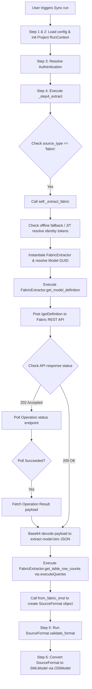

# Fabric Extraction Implementation

This document describes how semantic models are currently extracted from Microsoft Fabric and Power BI in the Semabridge project. 

---

## 1. Files Responsible for Fabric Extraction

The following files in the repository implement the Fabric semantic model extraction capabilities:

*   `src/semabridge/connectors/fabric_extractor.py`
    *   **Description**: Implements the low-level client connector (`FabricExtractor`) that interacts directly with Microsoft Fabric and Power BI REST API endpoints.
*   `src/semabridge/core/engine/extraction/fabric.py`
    *   **Description**: Implements the high-level orchestrator extraction step (`_extract_fabric`) bound to `ExecutionEngine`. It handles context parsing, offline file fallback, just-in-time (JIT) credential resolution, and wraps the raw API response.
*   `src/semabridge/core/engine/extraction/base.py`
    *   **Description**: Defines the platform-agnostic Step 4 engine method (`_step4_extract`) which routes the extraction request based on the source system type (`snowflake`, `fabric`, `pbix`).
*   `src/semabridge/core/source_format.py`
    *   **Description**: Defines the Pydantic-based `SourceFormat` class and parser helper functions that represent the platform-agnostic intermediate format.
*   `src/semabridge/core/engine/engine.py`
    *   **Description**: Standard 10-step `ExecutionEngine` runner that binds the extraction modules together and coordinates the transitions from Extraction (Step 4) to SML Conversion (Step 6).
*   `src/semabridge/sync/orchestrator.py`
    *   **Description**: Coordinates multi-model bidirectional synchronization jobs and handles dataset discovery.
*   `src/semabridge/cli/main.py`
    *   **Description**: The primary CLI entry point defining Typer commands for initiating extraction, listing models, and syncing measures.
*   `src/semabridge/cli/sync_commands.py`
    *   **Description**: CLI typer sub-application containing commands for executing bidirectional and scheduled sync jobs.

---

## 2. What Each File Does

### `src/semabridge/connectors/fabric_extractor.py`
This is the low-level API client for Microsoft Fabric. It executes raw HTTP requests, maintains an in-memory model lookup cache, performs JWT authentication handling, and queries table cardinalities or measures.

*   `FabricExtractionError(Exception)`: Custom exception raised when Fabric REST API calls, polling operations, or decoding processes fail.
*   `FabricExtractor`: Core class responsible for interacting with Fabric. Key methods include:
    *   `list_workspaces()`: Sends a `GET` request to `/workspaces` to retrieve a list of all Fabric workspaces visible to the caller.
    *   `resolve_workspace_id(workspace_id_or_name)`: Resolves a workspace's display name to its unique GUID. Returns the GUID directly if it already matches the GUID regex pattern.
    *   `list_semantic_models()`: Discovers available semantic models inside the configured workspace by trying candidate endpoints sequentially: `/semanticModels`, `/items?type=SemanticModel`, and `/datasets`.
    *   `resolve_model_id(dataset_id_or_name)`: Resolves a model's display name to its actual dataset GUID. 
    *   `get_model_display_name(dataset_id)`: Resolves a dataset ID back to its display name using cached lookups.
    *   `_get_access_token()`: Resolves Azure AD bearer tokens. Checks in order: (1) returns cached token if valid, (2) reads `FABRIC_ACCESS_TOKEN` env var, (3) executes an OAuth 2.0 client-credentials grant flow if a Service Principal `client_secret` is configured, (4) performs silent token refresh via stored refresh tokens inside the `CredentialManager`.
    *   `get_model_definition(dataset_id)`: Orchestrates the long-running async TMSL export. Sends a `POST` request to `/getDefinition?format=TMSL` and handles the `202 Accepted` status by polling.
    *   `_poll_operation(operation_url, retry_interval)`: Polls an operation ID in a loop until it succeeds. Supports regional redirect domain fallbacks.
    *   `_fetch_operation_result(operation_url)`: Sends a `GET` request to `.../operations/{id}/result` once polling succeeds.
    *   `_parse_definition_response(payload)`: Decodes the base64-encoded `model.bim` schema part and handles UTF-8 Byte Order Marks (BOM).
    *   `execute_dax_query(dataset_id, dax_query, silent)`: Executes raw DAX expressions via the Power BI REST API (`/executeQueries` endpoint).
    *   `get_table_row_counts(dataset_id)`: Fetches row counts for all non-hidden tables using DMV `INFO.TABLES()`.
    *   `execute_measure_sync_query(dataset_id, measure_name, group_by_dimensions, ...)`: Builds and executes an `EVALUATE` statement. Handles auto-date table filtering and switches to fallback patterns on context errors.
    *   `execute_paginated_measure_sync(...)`: Partitions DAX queries over a dimension column sequentially or concurrently via `TracedThreadPoolExecutor` to bypass the 100k row REST API limit.

### `src/semabridge/core/engine/extraction/fabric.py`
This module acts as the Step 4 engine-layer orchestrator for Fabric. It binds the low-level API calls to Semabridge's standard execution runtime.

*   `_extract_fabric(self, context, dataset_id, workspace_id)`:
    *   Coordinates offline mode by directly reading a local JSON TMSL model file if `offline_mode` is enabled.
    *   Loads workspace GUIDs from the local global credential store (`CredentialManager`) as a fallback if not configured.
    *   Handles scoped account-token resolution for multi-account scenarios (`identity_id`).
    *   Triggers JIT fresh token resolution to guarantee token validity in long-queued scheduled runs.
    *   Instantiates the `FabricExtractor` client and sets its access token.
    *   Retrieves the model definition (TMSL) and table cardinalities (row counts).
    *   Returns the initialized `SourceFormat` wrapper via `from_fabric_tmsl`.

### `src/semabridge/core/engine/extraction/base.py`
Provides the top-level Step 4 entry point for the standard `ExecutionEngine`.

*   `_step4_extract(self, context, dataset_id, workspace_id, pbix_path)`: Resolves `context.source_type` and routes execution flow to either `_extract_snowflake`, `_extract_fabric`, or `_extract_pbix`. Handles step status recording (`StepStatus.SUCCESS` or `StepStatus.FAILED`).

### `src/semabridge/core/source_format.py`
Defines the structure of the platform-agnostic intermediate format used to hold raw schema states.

*   `SourceFormat(BaseModel)`: Pydantic model containing metadata and schema payloads:
    *   `tmsl_definition`: Holds the parsed TMSL (JSON/dictionary structure of `model.bim`).
    *   `workspace_id`, `dataset_id`, `dataset_name`: Identify the source asset.
    *   `row_counts`: Map physical table names to cardinality integers.
    *   `validate_format()`: Applies Step 5 schema validations (e.g., verifying `tmsl_definition` exists when `source_type == "fabric"`).
*   `from_fabric_tmsl(project_id, run_id, tmsl, workspace_id, dataset_id, row_counts)`: Factory method initializing a `SourceFormat` object with the appropriate extraction metadata.

### `src/semabridge/core/engine/engine.py`
Coordinates the full 10-stage compilation pipeline.

*   `ExecutionEngine`: Binds other files dynamically at load time (e.g., binding `_extract_fabric` from `extraction/fabric.py`). During execution, calls:
    *   Step 3: `_step3_resolve_auth` to authenticate with target/source systems.
    *   Step 4: `_step4_extract` to fetch raw metadata.
    *   Step 5: `_step5_validate_source` to validate structural consistency of the `SourceFormat`.
    *   Step 6: `_step6_convert_to_sml` to trigger the SML compilation.

### `src/semabridge/sync/orchestrator.py`
Handles batch multi-model synchronization jobs.

*   `SyncOrchestrator`:
    *   `_discover_fabric_items(config, job_id)`: Automatically scans a Fabric workspace via `FabricExtractor.list_semantic_models()` to find syncable models.
    *   `_extract_fabric_to_osi(item)`: Directly extracts raw TMSL via `FabricExtractor` and runs it through `TMSLToOSIConverter` to output a intermediate `OSIModel`.

---

## 3. Extraction Flow (Step by Step)

### Flow A: Full CLI/API Orchestrated Sync Compilation (e.g., `semabridge sync run --direction fabric_to_snowflake`)
When a sync compilation pipeline runs, the extraction follows this step-by-step path:



1.  **Step 1: Initialization**: Typer commands or API calls invoke the `ExecutionEngine.execute()` method. The engine sets up the `RunContext` containing standard settings.
2.  **Step 2: Authenticate**: Step 3 (`_step3_resolve_auth`) verifies access tokens. If an `identity_id` is supplied, it JIT-renews tokens to prevent expiry during batch runs.
3.  **Step 3: Step 4 Invocation**: The engine calls `_step4_extract(context, dataset_id, workspace_id)`.
4.  **Step 4: Route to Fabric**: Since the source type is `fabric`, the engine routes the call to `_extract_fabric()`.
5.  **Step 5: Instantiate Extractor**: The orchestrator instantiates `FabricExtractor(fabric_cfg)`. It resolves the dataset display name to its GUID using `resolve_model_id()`.
6.  **Step 6: API Export Initiation**: The client executes a `POST` request to `https://api.fabric.microsoft.com/v1.0/myorg/workspaces/{workspace_id}/semanticModels/{dataset_id}/getDefinition?format=TMSL`.
7.  **Step 7: Async Polling Loop**: Because TMSL generation is intensive, Fabric typically returns `202 Accepted` with a `Location` header. The engine enters `_poll_operation()`, querying the operation status endpoint every 10 seconds.
8.  **Step 8: Fetching & Decoding Results**: Once the status reports `"Succeeded"`, the client sends a `GET` request to `.../operations/{id}/result`. The JSON response returns parts. The client finds the part with path `"model.bim"`, decodes the inline base64 payload, removes any UTF-8 BOM, and parses it into a Python dictionary.
9.  **Step 9: Querying Cardinalities (Row Counts)**: The client calls `get_table_row_counts()` which posts a DAX query targeting the DMV `INFO.TABLES()` to retrieveestimated cardinalities of non-hidden tables.
10. **Step 10: Wrapping the Artifact**: The engine calls `from_fabric_tmsl(...)` and returns a `SourceFormat` instance stored under `context.source_format` for downstream validation (Step 5) and conversion (Step 6).

### Flow B: DAX Measure Synchronization (e.g., `semabridge sync-measures`)
Used to extract and sync complex DAX measures (window functions, time intelligence) that cannot be translated directly into SQL views:

1.  **CLI Init**: Typer invokes `sync_measures()`.
2.  **Fetch Definition**: The command instantiates `FabricExtractor` and calls `get_model_definition()` to retrieve the TMSL representation.
3.  **Convert to SML**: The TMSL is converted to `SMLModel` via an intermediate `OSIModel` to identify metrics that have `sync_enabled=True`.
4.  **Execute Paginated Sync**: For each syncable measure, the engine calls `FabricExtractor.execute_paginated_measure_sync()`.
    *   The extractor partitions the dataset over a dimension (like `'Date'[Year]`) to bypass the Power BI REST API 100k row limit.
    *   Queries are sent sequentially or concurrently using `TracedThreadPoolExecutor` (max 5 threads) to the executeQueries endpoint (`https://api.powerbi.com/v1.0/myorg/datasets/{id}/executeQueries`).
    *   If a context transition error is raised (common with `SUMMARIZECOLUMNS`), the extractor automatically retries the partition using a fallback DAX pattern (`ADDCOLUMNS(SUMMARIZE(...), "Value", CALCULATE(...))`).
5.  **Write results to Snowflake**: The resulting partition values are combined and emitted to custom `MEASURES_<name>` tables in Snowflake by `SnowflakeEmitter`.

---

## 4. Data Structures Used

Extraction payloads transition through specific intermediate Pydantic data structures before SML serialization:

### `SourceFormat` (Defined in `src/semabridge/core/source_format.py`)
Holds the raw metadata immediately after step-4 API extraction.
*   `source_type`: Will be explicitly set to `"fabric"`.
*   `tmsl_definition`: A `Dict[str, Any]` representation of the extracted `model.bim` file.
*   `workspace_id`: GUID of the containing Fabric workspace.
*   `dataset_id`: GUID of the semantic model.
*   `dataset_name`: Display name of the model.
*   `row_counts`: A `Dict[str, int]` mapping table names to physical cardinalities.

### `OSIModel` (Defined in `src/semabridge/intermediate/models.py`)
The **Open Semantic Interchange (OSI)** model acts as a vendor-neutral "Rosetta Stone" intermediate format.
*   `unique_name`: Unique model identifier.
*   `datasets`: A list of `OSIDataset` objects representing logical tables, wrapping columns (`List[OSIColumn]`) with normalized data types (`OSIDataType`).
*   `metrics`: A list of `OSIMetric` objects containing calculated measures, expressions, complexity tiers, and Cortex search metadata.
*   `relationships`: A list of `OSIRelationship` objects establishing join paths between tables. It automatically normalizes joint-keys into a standard canonical naming format: `REL_<FROM_TABLE>_<FROM_COLUMN>__<TO_TABLE>_<TO_COLUMN>`.
*   `dimensions`: A list of `OSIDimension` objects detailing attributes and hierarchies.
*   **PRD Architectural Boundaries**: The structure enforces model size limits: maximum 75 datasets per model, maximum 75 relationships, and displays warnings when the model exceeds 100 total columns to prevent context window exhaustion in downstream Cortex Analyst models.

---

## 5. Dependencies

Fabric extraction relies on the following external packages:

*   `requests`: Used for executing all HTTP methods against the Fabric and Power BI REST APIs, executing HTTP retries, handling transient network timeouts, and executing DAX query payloads.
*   `httpx`: Used by `FabricTokenValidator` to query Microsoft's public JWKS endpoint.
*   `msal`: Microsoft Authentication Library. Acquires OAuth 2.0 device codes and triggers silent refresh tokens for delegated/interactive user flows.
*   `pyjwt` (or `jwt`): Decodes and validates JWT bearer tokens, evaluating `exp` (expiry) and `nbf` (not-before) claims.
*   `cryptography`: Essential cryptographic library backing token decoders.
*   `pydantic` (v2): Powers the configuration settings, `SourceFormat` schema validations, and standard `OSIModel` representation models.

---

## 6. Configuration

Fabric extraction is configured using the following parameters:

### Environment Variables
*   `FABRIC_ACCESS_TOKEN`: Pre-issued bearer token. If valid (expiry checked from the JWT `exp` claim), it bypasses all other authentication flows.
*   `FABRIC_CLIENT_ID`: Entra ID Application (Client) ID. Required for both Service Principal and device-code flows.
*   `FABRIC_CLIENT_SECRET`: Entra ID Application Client Secret (required for headless Service Principal client credentials auth).
*   `FABRIC_TENANT_ID`: Entra ID Tenant ID.
*   `FABRIC_WORKSPACE_ID`: Target Workspace GUID.
*   `SEMABRIDGE_RECOMMENDED_DATASET_COLUMN_LIMIT`: Configures maximum columns warning threshold (default: 75).
*   `SEMABRIDGE_RECOMMENDED_MODEL_TOTAL_COLUMN_LIMIT`: Configures maximum total columns warning threshold (default: 100).

### Project Configuration (`FabricConfig` in `semabridge.yaml`)
```yaml
fabric:
  tenant_id: "00000000-0000-0000-0000-000000000000"
  client_id: "00000000-0000-0000-0000-000000000000"
  client_secret: "secure-client-secret-here"
  workspace_id: "00000000-0000-0000-0000-000000000000"
  api_base_url: "https://api.fabric.microsoft.com/v1.0"
```

---

## 7. Known Limitations

*   **Opaque Token Validation**: Power BI and Microsoft Fabric interactive access tokens are frequently opaque or use internal MAC keys. Their signature cannot be verified locally using Microsoft's public JWKS keys (`/discovery/v2.0/keys`). The `FabricTokenValidator` bypasses `verify_signature=True` for these tokens to avoid runtime crashes, relying on remote authorization validation by the Fabric REST API itself.
*   **Hidden Auto-Generated Date Tables**: Power BI automatically generates hidden date dimensions (`LocalDateTable_*`, `DateTableTemplate_*`). Referencing these tables in Power BI REST API queries triggers a `400 Bad Request` with `<oii>` tags in the response body. The extractor automatically strips these columns during DAX generation.
*   **DMV Restriction Risk**: `INFO.TABLES()` relies on DMV queries which can sometimes be restricted depending on the tenant or workspace capacities.
*   **Strict 100k Row API Limits**: The `/executeQueries` endpoint enforces a hard limit of 100,000 returned rows. Large datasets must have a suitable date partitioning column (like `'Date'[Year]`) to enable the paginated sync process.
*   **Measure Complexity Boundaries**: Complex calculations (Tier 3 time intelligence or Tier 4 custom evaluation contexts) cannot be converted directly into Snowflake SQL semantic views. Instead, they must be materialised and copied via the `sync-measures` pipeline.

---

## 8. Entry Points

Fabric extraction can be initiated through several pathways:

### CLI Commands
*   **Run a Full Sync Pipeline**:
    ```bash
    semabridge sync run --direction fabric_to_snowflake --workspace-id <WS_GUID>
    ```
*   **Sync Complex DAX Measures**:
    ```bash
    semabridge sync-measures --dataset-id <DATASET_GUID> --partition-by "'Date'[Year]"
    ```
*   **List Semantic Models**:
    ```bash
    semabridge list-fabric-models
    ```

### Direct Function / API Invocation
*   **Orchestrated Engine Execution**:
    ```python
    from semabridge.core.engine.engine import ExecutionEngine
    
    engine = ExecutionEngine()
    summary = engine.execute(
        source="fabric",
        target="snowflake",
        dataset_id="00000000-0000-0000-0000-000000000000",
        workspace_id="00000000-0000-0000-0000-000000000000"
    )
    ```
*   **Direct Extractor Calls**:
    ```python
    from semabridge.connectors.fabric_extractor import FabricExtractor
    from semabridge.core.settings import get_settings
    
    extractor = FabricExtractor(get_settings().fabric)
    tmsl_definition = extractor.get_model_definition(dataset_id="...")
    row_counts = extractor.get_table_row_counts(dataset_id="...")
    ```
