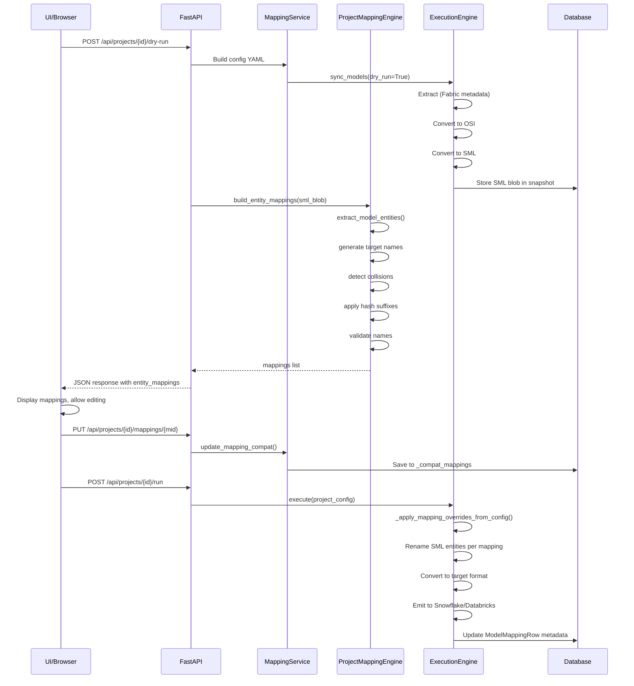

# Model Mapping — Complete Technical Reference

## 1. Overview

### What is Model Mapping in Semabridge?

Model mapping is the core feature that enables semantic entity resolution—mapping source platform entities (Fabric datasets, columns, measures) to target platform names (Snowflake table/column identifiers, Databricks semantic view dimensions/measures). It solves the problem of identifier portability across different platforms with different naming constraints.

### Why It Exists

Semabridge synchronizes semantic models across heterogeneous platforms (Fabric ↔ Snowflake ↔ Databricks). Each platform has:
- Different naming rules (Snowflake reserves keywords; Fabric allows spaces)
- Different entity types (Fabric has "measures"; Snowflake has columns)
- Different identifier lengths and character restrictions

Model mapping provides a bridge that:
1. Auto-generates target identifiers compliant with each platform's rules
2. Detects name collisions and applies deterministic suffixes
3. Allows user editing before deployment
4. Persists mappings so incremental syncs reuse prior choices
5. Integrates with DAX-to-SQL conversion for measure-to-fact anchoring

### How It Fits into the Overall Pipeline Architecture

```
┌─────────────────────────────────────────────────────────────────────┐
│                        Semabridge Pipeline                           │
├─────────────────────────────────────────────────────────────────────┤
│                                                                       │
│  UI/API Input                                                         │
│      ↓                                                                │
│  [Step 1: Load Config] ← Loads mapping profiles from Config/profiles/ │
│      ↓                                                                │
│  [Step 2: Dry-Run / Auto-Map] ← build_entity_mappings()             │
│      ├─ Extracts source entities (datasets, columns, metrics)        │
│      ├─ Generates target identifiers (Snowflake/Databricks rules)    │
│      ├─ Detects collisions & applies hash suffixes                   │
│      └─ Returns mappings for user review/edit                        │
│      ↓                                                                │
│  [UI: User Reviews & Edits Mappings]                                 │
│      ↓                                                                │
│  [Step 3: Save Mappings] → ModelMappingRow (database persistence)    │
│      ↓                                                                │
│  [Step 4: Extract] ← Reads mappings; filters source entities         │
│      ↓                                                                │
│  [Step 5: Convert to OSI] ← Applies mapping overrides to names       │
│      ↓                                                                │
│  [Step 6: Convert to SML] ← Measure-to-fact mapping via DAX parsing  │
│      ↓                                                                │
│  [Step 7: Convert to Target] ← Apply target connector naming rules    │
│      ↓                                                                │
│  [Step 8: Emit to Target] ← Deploy with final mapped names           │
│                                                                       │
└─────────────────────────────────────────────────────────────────────┘
```

---

## 2. Mapping Data Model

### 2.1 Complete Field Reference

| Field | Type | Required | Description | Source |
|-------|------|----------|-------------|--------|
| `id` / `mapping_id` | `str` (UUID) | Yes | Unique mapping identifier | Auto-generated via `uuid.uuid5()` |
| `source_type` | `str` | Yes | Source platform type: `"pbix"`, `"fabric"`, `"snowflake"`, `"snowflake_semantic_view"` | From sync config |
| `source_identifier` | `str` | Yes | Source entity path or artifact ID (e.g., `"workspace_id:dataset_name"`) | From source connector |
| `target_type` | `str` | Yes | Target platform type: `"snowflake"`, `"databricks"`, `"fabric"`, `"snowflake_semantic_view"` | From target config |
| `target_identifier` | `str` | Yes | Target entity name (e.g., `"PUBLIC.MY_TABLE"`) | User-edited or auto-generated |
| `model_name` | `str` | Yes | Canonical semantic model name | From source (Fabric dataset or PBIX model) |
| `last_synced_at` | `datetime` (ISO-8601) | No | Timestamp of last successful sync using this mapping | Updated on successful deployment |
| `last_osi_hash` | `str` (SHA-256 hex) | No | Hash of OSI model at last sync; enables change detection | Updated on sync |
| `fabric_model_id` | `str` (GUID) | No | Fabric semantic model GUID (for Fabric ↔ Snowflake bidirectional sync) | From Fabric metadata |
| `snowflake_semantic_view` | `str` | No | Fully-qualified Snowflake semantic view name | From Snowflake catalog |
| `created_at` | `datetime` (ISO-8601) | No | Mapping creation timestamp | Server-default at creation |
| `is_active` | `bool` | No | Whether mapping is active (soft-delete via `is_active=false`) | Default `true` |

### 2.2 Pydantic Model Definition

**File:** [src/semabridge/sync/models.py](src/semabridge/sync/models.py#L175-L210)

```python
class ModelMapping(BaseModel):
    """Maps a source model to its target counterparts."""
    
    mapping_id: str = Field(
        default_factory=_new_id, 
        description="Unique mapping ID"
    )
    source_type: str = Field(
        ...,
        description="Source platform: 'pbix', 'snowflake', 'fabric', 'snowflake_semantic_view'"
    )
    source_identifier: str = Field(
        ..., 
        description="Source path or artifact ID"
    )
    target_type: str = Field(
        ...,
        description="Target platform: 'snowflake', 'fabric', 'snowflake_semantic_view'"
    )
    target_identifier: str = Field(
        ..., 
        description="Target schema, dataset ID, or semantic view name"
    )
    model_name: str = Field(
        ..., 
        description="Canonical model name"
    )
    last_synced_at: Optional[str] = Field(
        default=None, 
        description="Last successful sync"
    )
    last_osi_hash: Optional[str] = Field(
        default=None, 
        description="Hash of last synced OSI model for change detection"
    )
    fabric_model_id: Optional[str] = Field(
        default=None, 
        description="Fabric semantic model GUID (for Fabric↔Snowflake)"
    )
    snowflake_semantic_view: Optional[str] = Field(
        default=None,
        description="Fully-qualified Snowflake semantic view name mapped to this model"
    )
    created_at: str = Field(
        default_factory=_utc_now, 
        description="Mapping creation time"
    )
    is_active: bool = Field(
        default=True, 
        description="Whether mapping is active"
    )

    model_config = {"extra": "forbid"}  # Strict validation
```

### 2.3 Database Schema

**File:** [src/semabridge/repository/orm/models.py](src/semabridge/repository/orm/models.py#L625-L650)

```sql
CREATE TABLE model_mappings (
    mapping_id VARCHAR(36) PRIMARY KEY,
    source_type VARCHAR(50) NOT NULL,
    source_identifier VARCHAR(255) NOT NULL,
    target_type VARCHAR(50) NOT NULL,
    target_identifier VARCHAR(255) NOT NULL,
    model_name VARCHAR(255) NOT NULL,
    last_synced_at TIMESTAMPTZ,
    last_osi_hash VARCHAR(64),
    created_at TIMESTAMPTZ NOT NULL DEFAULT CURRENT_TIMESTAMP,
    is_active BOOLEAN NOT NULL DEFAULT TRUE
);
```

**ORM Class:** `ModelMappingRow`

```python
class ModelMappingRow(Base):
    """Source ↔ target mapping registry."""

    __tablename__ = "model_mappings"

    mapping_id: Mapped[str] = mapped_column(String(36), primary_key=True)
    source_type: Mapped[str] = mapped_column(String(50), nullable=False)
    source_identifier: Mapped[str] = mapped_column(String(255), nullable=False)
    target_type: Mapped[str] = mapped_column(String(50), nullable=False)
    target_identifier: Mapped[str] = mapped_column(String(255), nullable=False)
    model_name: Mapped[str] = mapped_column(String(255), nullable=False)
    last_synced_at: Mapped[Optional[datetime]] = mapped_column(_UTC_DT, nullable=True)
    last_osi_hash: Mapped[Optional[str]] = mapped_column(String(64), nullable=True)
    created_at: Mapped[Optional[datetime]] = mapped_column(
        _UTC_DT, server_default=func.now(), nullable=True
    )
    is_active: Mapped[bool] = mapped_column(
        Boolean, nullable=False, default=True, server_default=true()
    )
```

### 2.4 Data Shape at Each Layer

#### A. API JSON Request (POST /api/projects/{project_id}/dry-run)

```json
{
  "source_config": {
    "type": "fabric",
    "workspace_id": "550e8400-e29b-41d4-a716-446655440000",
    "identity_id": "my-fabric-account",
    "database": "semantic_database"
  },
  "target_config": {
    "type": "snowflake",
    "account": "my_account",
    "warehouse": "COMPUTE_WH",
    "database": "ANALYTICS_DB",
    "schema": "SEMANTIC",
    "identity_id": "my-snowflake-account"
  },
  "selected_sources": ["Sales Model", "Inventory Model"]
}
```

#### B. API JSON Response (POST /api/projects/{project_id}/dry-run)

```json
{
  "success": true,
  "entity_mappings": [
    {
      "id": "p1-c2a3b4d5e6f7g8h9",
      "entity_kind": "column",
      "source_name": "Sales_Amount",
      "source_data_type": "decimal",
      "source_table": "Sales",
      "source_path": "datasets.Sales.columns.Sales_Amount",
      "source_qualified_path": "Sales_Model.Sales.Sales_Amount",
      "target_name": "SALES_AMOUNT",
      "target_data_type": "decimal",
      "mapping_status": "auto",
      "status": "auto",
      "suggested_target_name": "SALES_AMOUNT",
      "collision_detected": false,
      "validation_status": "valid",
      "validation_code": "OK",
      "validation_message": "Identifier is valid.",
      "measure_source_tables": [],
      "source_expression": null
    },
    {
      "id": "p1-a1b2c3d4e5f6g7h8",
      "entity_kind": "measure",
      "source_name": "Total_Sales",
      "source_data_type": "decimal",
      "source_table": "Sales",
      "source_path": "metrics.Total_Sales",
      "source_qualified_path": "Sales_Model.Total_Sales",
      "target_name": "TOTAL_SALES",
      "target_data_type": "decimal",
      "mapping_status": "auto",
      "status": "auto",
      "suggested_target_name": "TOTAL_SALES",
      "collision_detected": false,
      "validation_status": "valid",
      "validation_code": "OK",
      "validation_message": "Identifier is valid.",
      "measure_source_tables": ["Sales"],
      "source_expression": "SUM(Sales[Sales_Amount])"
    }
  ],
  "summary": {
    "total_fields": 2,
    "auto_mapped": 2,
    "unmapped": 0,
    "collisions": 0
  }
}
```

#### C. Python Pydantic Model

```python
# From Pydantic ModelMapping class
mapping = ModelMapping(
    mapping_id="p1-c2a3b4d5e6f7g8h9",
    source_type="fabric",
    source_identifier="workspace_id:dataset_name",
    target_type="snowflake",
    target_identifier="PUBLIC.SALES_AMOUNT",
    model_name="Sales Model",
    last_synced_at="2026-05-05T14:32:00+00:00",
    last_osi_hash="abc123def456...",
    created_at="2026-05-05T10:00:00+00:00",
    is_active=True
)
```

#### D. Database Row (SQLAlchemy ORM)

```python
# Row fetched from model_mappings table
row = session.query(ModelMappingRow).filter(
    ModelMappingRow.mapping_id == "p1-c2a3b4d5e6f7g8h9"
).first()

# Accessible attributes:
# row.mapping_id → "p1-c2a3b4d5e6f7g8h9"
# row.source_type → "fabric"
# row.source_identifier → "workspace_id:dataset_name"
# row.target_type → "snowflake"
# row.target_identifier → "PUBLIC.SALES_AMOUNT"
# row.model_name → "Sales Model"
# row.created_at → datetime object (converted to ISO-8601 string by _dt_to_str())
# row.is_active → True
```

#### E. Execution Engine Consumption (In-Memory SML)

The execution engine consumes mappings indirectly via the SML (Semantic Mapping Language) model after overrides are applied:

```python
# After _apply_mapping_overrides_from_config() runs:
sml_model.datasets[0].columns[0].unique_name = "SALES_AMOUNT"  # mapped target name
sml_model.metrics[0].unique_name = "TOTAL_SALES"               # mapped target name
sml_model.datasets[0].columns[0].label = "SALES_AMOUNT"
sml_model.metrics[0].label = "TOTAL_SALES"
```

---

## 3. API Reference

### POST /api/projects/{project_id}/dry-run

**Purpose:** Perform a dry-run mapping operation by executing the full extraction + OSI + SML pipeline WITHOUT deployment. Returns field-level entity mappings (columns + measures) for user review and editing.

**Request Body:**

```json
{
  "source_config": {
    "type": "fabric" | "snowflake" | "pbix",
    "workspace_id": "string (optional, for Fabric)",
    "identity_id": "string (optional)",
    "database": "string (optional)",
    "schema": "string (optional)"
  },
  "target_config": {
    "type": "snowflake" | "databricks" | "fabric",
    "account": "string (optional, for Snowflake)",
    "warehouse": "string (optional)",
    "database": "string (optional)",
    "schema": "string (optional)",
    "workspace_id": "string (optional, for Databricks/Fabric)",
    "identity_id": "string (optional)"
  },
  "selected_sources": ["model_name_1", "model_name_2"]
}
```

**Response Body:** (HTTP 200)

```json
{
  "success": true,
  "entity_mappings": [
    {
      "id": "string (mapping ID)",
      "entity_kind": "column" | "measure" | "field",
      "source_name": "string",
      "source_data_type": "string",
      "source_table": "string",
      "source_path": "string (e.g., 'datasets.TableName.columns.ColumnName')",
      "source_qualified_path": "string",
      "target_name": "string",
      "target_data_type": "string",
      "mapping_status": "auto" | "manual" | "collision",
      "status": "auto" | "manual" | "unmapped",
      "suggested_target_name": "string",
      "collision_detected": boolean,
      "validation_status": "valid" | "invalid" | "collision",
      "validation_code": "OK" | "RESERVED_KEYWORD" | "UNSUPPORTED_CHARACTERS" | "EMPTY_TARGET" | "NAME_COLLISION",
      "validation_message": "string",
      "measure_source_tables": ["table_name_1", "table_name_2"],
      "source_expression": "string (DAX expression for measures)" | null
    }
  ],
  "summary": {
    "total_fields": number,
    "auto_mapped": number,
    "unmapped": number,
    "collisions": number
  }
}
```

**Error Responses:**

| Code | Condition |
|------|-----------|
| 400 | Invalid source/target configuration |
| 401 | Authentication failed for source or target |
| 404 | Source model not found |
| 500 | Internal error during extraction/conversion |

**Business Logic Triggered:**

1. Builds config YAML from wizard inputs
2. Creates/resolves preview project
3. Runs full pipeline (extraction → OSI → SML)
4. Loads SML blob from preferred snapshot
5. Calls `build_entity_mappings()` to generate entity mappings
6. Filters to field-level only (columns + measures, no tables)
7. Applies collision detection and hash suffixes
8. Normalizes "metric" → "measure" for frontend

**File Reference:** [src/semabridge/api/controllers/mappings_controller.py](src/semabridge/api/controllers/mappings_controller.py#L101-L280)

---

### PUT /api/projects/{project_id}/mappings/{mapping_id}

**Purpose:** Update a single mapping with user-edited target name and optional validation status.

**Request Body:**

```json
{
  "target_name": "string (new target name)",
  "target_data_type": "string (optional, data type)",
  "status": "manual" | "auto" | "unmapped"
}
```

**Response Body:** (HTTP 200)

```json
{
  "mapping_id": "string",
  "target_name": "string",
  "status": "string",
  "updated_at": "2026-05-05T14:32:00+00:00"
}
```

**Validation Rules:**

- Target name cannot be empty
- For Snowflake: reserved keywords prefixed with `COL_`, unsupported characters replaced with `_`
- For Databricks: similar validation as Snowflake
- Collision detection applied if multiple entities map to same target name

**Error Responses:**

| Code | Condition |
|------|-----------|
| 400 | Invalid target name or data type |
| 404 | Mapping not found |
| 409 | Target name collision with existing mapping |

**File Reference:** [src/semabridge/api/controllers/mappings_controller.py](src/semabridge/api/controllers/mappings_controller.py#L310-L340)

---

### GET /api/mappings?project_id={id}

**Purpose:** Retrieve all mappings for a project.

**Query Parameters:**

| Parameter | Type | Description |
|-----------|------|-------------|
| `project_id` | string (required) | Project ID |

**Response Body:** (HTTP 200)

```json
[
  {
    "mapping_id": "string",
    "source_type": "fabric" | "snowflake",
    "source_identifier": "string",
    "target_type": "snowflake" | "databricks",
    "target_identifier": "string",
    "model_name": "string",
    "last_synced_at": "2026-05-05T14:32:00+00:00" | null,
    "created_at": "2026-05-05T10:00:00+00:00",
    "is_active": boolean
  }
]
```

**File Reference:** [src/semabridge/api/services/mappings_service.py](src/semabridge/api/services/mappings_service.py#L1-L10)

---

### DELETE /api/mappings?project_id={id}

**Purpose:** Delete all mappings for a project (soft-delete via `is_active=false`).

**Query Parameters:**

| Parameter | Type | Description |
|-----------|------|-------------|
| `project_id` | string (required) | Project ID to delete mappings for |

**Response Body:** (HTTP 200)

```json
{
  "success": true,
  "deleted_count": number
}
```

**File Reference:** [src/semabridge/api/services/mappings_service.py](src/semabridge/api/services/mappings_service.py#L1-L10)

---

## 4. Auto-Mapping Logic

### How Auto-Mapping Works

Auto-mapping is triggered when:
1. User opens the wizard and selects source and target connectors
2. User clicks "Generate Mappings" (POST /api/projects/{id}/dry-run)
3. Execution engine loads mappings override section of config YAML

### Algorithm

**File:** [src/semabridge/api/services/project_mapping_engine.py](src/semabridge/api/services/project_mapping_engine.py#L280-L450)

1. **Extract Entities** → `extract_model_entities()` parses SML model:
   - Extracts datasets (tables) with `entity_kind="table"`
   - For each dataset, extracts columns with `entity_kind="column"`
   - For each metric, extracts with `entity_kind="metric"` and `measure_source_tables` list

2. **Generate Default Target Names** → `_default_target_identifier()`:
   - For Snowflake: Uses `IdentifierSanitizer.sanitize_alias()` → uppercase, no special chars
   - For Databricks: Uses `sanitize_identifier()` → uppercase, `_` for special chars
   - Example: `"Sales Amount"` → `"SALES_AMOUNT"`

3. **Detect Collisions** → `build_entity_mappings()` groups by scope:
   - `scope_key = "column::{parent_dataset}" | "table::{model_name}" | "metric::{model_name}"`
   - For each scope, groups entities by sanitized name
   - If 2+ entities map to same name, collision detected

4. **Apply Collision Suffix** → `apply_collision_suffix()`:
   - Generates deterministic 4-char SHA-1 hash from source path
   - Applies as suffix: `"SALES_AMOUNT_A1B2"` instead of `"SALES_AMOUNT"`
   - Ensures same source path always gets same suffix across runs

5. **Validate Target Names** → `_validate_target_name()`:
   - Checks for Snowflake reserved keywords
   - For reserved keywords: applies `COL_` prefix
   - For unsupported chars: sanitizes and returns suggested name
   - Returns `validation_status`, `validation_code`, `validation_message`

6. **Return Mappings** → With fields:
   - `id`: UUID from `uuid.uuid5(NAMESPACE_URL, f"{project_id}:{source_path}")`
   - `source_name`, `source_path`, `source_qualified_path`
   - `target_name`, `target_data_type`
   - `collision_detected`, `validation_status`, `validation_code`
   - `measure_source_tables` for metrics

### Matching Rules

Source fields are matched to target names by:
1. **Direct mapping** - Source name → sanitized target name (case-insensitive)
2. **Collision-aware** - Multiple sources → same base name → add hash suffix
3. **Platform-aware** - Target connector determines validation rules

### Confidence/Score Mechanism

Currently: **No explicit confidence scoring.**
- All auto-generated mappings are treated as `status="auto"` (high confidence)
- User-edited mappings are `status="manual"`
- Unmapped entities are `status="unmapped"`
- Collision-resolved mappings are `status="collision"` with `collision_detected=true`

### When No Match is Found

- Unmapped columns/measures receive `status="unmapped"` and `target_name=""`
- These are flagged in the dry-run summary for user attention
- User can manually provide target names in the UI

**Code Reference:**

- `build_entity_mappings()` - Main function: [project_mapping_engine.py](src/semabridge/api/services/project_mapping_engine.py#L280-L450)
- `extract_model_entities()` - Entity extraction: [project_mapping_engine.py](src/semabridge/api/services/project_mapping_engine.py#L140-L210)
- `_validate_target_name()` - Validation: [project_mapping_engine.py](src/semabridge/api/services/project_mapping_engine.py#L225-L260)
- `apply_collision_suffix()` - Collision handling: [project_mapping_engine.py](src/semabridge/api/services/project_mapping_engine.py#L50-L60)

---

## 5. Mapping Lifecycle — End to End

### Complete Lifecycle Walkthrough

```
1. UI: User Opens Project Configuration Wizard
   → User selects Fabric workspace and models
   → User selects Snowflake target account/warehouse
   → Clicks "Generate Mappings"

2. API: POST /api/projects/{project_id}/dry-run
   → mappings_controller.dry_run_mapping()
   File: src/semabridge/api/controllers/mappings_controller.py#L101-L280

3. Service: Build Config YAML
   → _build_config_yaml_from_request() assembles minimal semabridge.yaml
   → source: {type: fabric, workspace_id, models}
   → targets: [{type: snowflake, account, database, schema}]
   File: src/semabridge/api/controllers/mappings_controller.py#L42-L87

4. Core: Run Sync Pipeline (Dry-Run)
   → sync_models() executes full pipeline with dry_run=True
   → Stage 1: Load Configuration
   → Stage 2: Extract (Fabric connector reads metadata)
   → Stage 3: Convert to OSI (Fabric TMSL → OSI model)
   → Stage 4: Convert to SML (OSI → SML canonical model)
   → Stores SML blob in snapshot
   File: src/semabridge/core/engine/engine.py

5. Mapping Engine: Auto-Generate Entity Mappings
   → build_entity_mappings() called with SML blob
   → extract_model_entities() parses datasets, columns, metrics
   → For each entity: generate target name via _default_target_identifier()
   → Detect collisions via scope-based grouping
   → Apply hash suffixes for collisions
   → Validate names (reserved keywords, special chars)
   File: src/semabridge/api/services/project_mapping_engine.py#L280-L450

6. Response: Return Field-Level Mappings
   → Filter to columns + measures only (no tables)
   → Normalize "metric" → "measure" for frontend
   → Apply MappingService.add_collision_handling()
   → Return JSON with entity_mappings list
   File: src/semabridge/api/controllers/mappings_controller.py#L220-L270

7. UI: User Reviews & Edits Mappings
   → Frontend displays mappings in table
   → User can edit target_name, status
   → User can toggle unmapped → manual
   → User clicks "Save Project"

8. API: Save Project & Mappings
   → PUT /api/projects/{project_id}/mappings/{mapping_id}
   → update_mapping_compat() saves edits to _compat_mappings
   → or auto_map_compat() saves auto-generated mappings
   File: src/semabridge/api/services/project_runs_impl.py

9. Core: Apply Mapping Overrides to Config
   → When user runs pipeline: _apply_mapping_overrides_from_config()
   → Reads mappings_overrides from config YAML
   → For each override: renames SML entity
   → datasets[i].columns[j].unique_name = target_name
   → metrics[k].unique_name = target_name
   File: src/semabridge/core/engine/config.py#L30-L110

10. Pipeline: Emit to Target
    → DDL builder applies duplicate name mapping precomputation
    → Snowflake emitter writes final DDL with mapped names
    → Metric views created with mapped dimension/measure names

11. Post-Run: Update Mapping Metadata
    → ModelMappingRow.last_synced_at = now
    → ModelMappingRow.last_osi_hash = hash(sml_blob)
    → Next sync can detect if source changed via hash
    File: src/semabridge/sync/repository.py
```

### Sequence Diagram



---

## 6. Pipeline Integration

### 6.1 Stage 1 — Configuration Loading

**How mappings are loaded:**

The execution engine loads mappings from the project configuration (YAML):

```yaml
project_name: "My Sales Model"
source:
  type: fabric
  workspace_id: "550e8400-e29b-41d4-a716-446655440000"
  models: ["Sales Model"]

targets:
  - type: snowflake
    account: "my_account"
    schema: "ANALYTICS"

mappings:  # Auto-generated or user-provided
  - source: "Sales"
    target: "SALES_FACT"
    type: "table"
    columns:
      - source: "Sales Amount"
        target: "SALES_AMOUNT"

mappings_overrides:  # Applied before deploy
  - source_path: "datasets.Sales"
    target_name: "SALES_FACT"
    entity_kind: "table"
  - source_path: "datasets.Sales.columns.Sales Amount"
    target_name: "SALES_AMOUNT"
    entity_kind: "column"
```

**Fields required:**

- `source_path`: Entity identifier (e.g., `"datasets.TableName.columns.ColumnName"`)
- `target_name`: Mapped target identifier
- `entity_kind`: `"column"`, `"table"`, `"metric"`, `"relationship"`

**Validation performed:**

1. `source_path` must match entity in SML model
2. `target_name` must comply with target connector rules
3. No duplicate `source_path` entries (last one wins)

**File Reference:**

- Config loading: [src/semabridge/core/engine/config.py](src/semabridge/core/engine/config.py#L30-L110)
- Override application: `_apply_mapping_overrides_from_config()`

---

### 6.2 Stage 4 — Source Extraction

**How mappings influence extraction:**

Mappings do NOT affect extraction from the source. The extraction stage reads all available entities from the source (Fabric metadata API, PBIX TMSL, Snowflake INFORMATION_SCHEMA) regardless of mappings.

Mappings only affect **post-extraction processing**:

1. **Entity filtering** - Some connectors may skip unmapped entities
2. **Column filtering** - If a column is unmapped, it may be excluded from OSI
3. **Measure filtering** - Unmapped measures may not be converted

**File Reference:**

- Fabric extractor: [src/semabridge/connectors/fabric_extractor.py](src/semabridge/connectors/fabric_extractor.py)
- PBIX extractor: [src/semabridge/connectors/local_pbix_handler.py](src/semabridge/connectors/local_pbix_handler.py)

---

### 6.3 Stage 6 — SML Conversion

**How mappings influence SML:**

After the OSI model is converted to SML, mapping overrides are applied via `_apply_mapping_overrides_from_config()`:

```python
def _apply_mapping_overrides_from_config(
    sml_model: SMLModel,
    config_path: Path,
    config_payload: Optional[Dict[str, Any]] = None,
) -> None:
    """Apply user-edited mapping overrides from config to SML names before deploy."""
    
    # Parse mappings_overrides from config
    for override in config.get("mappings_overrides", []):
        source_path = override["source_path"]  # e.g., "datasets.Sales.columns.Amount"
        target_name = override["target_name"]   # e.g., "SALES_AMOUNT"
        
        # Match source_path to SML entity and rename
        if source_path.startswith("metrics."):
            metric_name = source_path[len("metrics."):]
            for metric in sml_model.metrics:
                if metric.unique_name == metric_name:
                    metric.unique_name = target_name
                    metric.label = target_name
                    break
        
        elif "datasets." in source_path and ".columns." in source_path:
            dataset_name = source_path.split(".")[1]
            column_name = source_path.split(".columns.")[-1]
            for dataset in sml_model.datasets:
                if dataset.unique_name == dataset_name:
                    for column in dataset.columns:
                        if column.unique_name == column_name:
                            column.unique_name = target_name
                            column.label = target_name
                            break
```

**Which mapping fields map to which SML concepts:**

| Mapping Field | SML Concept | Transformation |
|---------------|-----------|---|
| `source_path: "datasets.TableName"` | `SMLDataset.unique_name` | Set to `target_name` |
| `source_path: "datasets.TableName.columns.ColumnName"` | `SMLDataset.columns[i].unique_name` | Set to `target_name` |
| `source_path: "metrics.MetricName"` | `SMLMetric.unique_name` | Set to `target_name` |
| `source_path: "relationships.RelName"` | `SMLRelationship.unique_name` | Set to `target_name` |

**File Reference:**

- Override application: [src/semabridge/core/engine/config.py](src/semabridge/core/engine/config.py#L30-L110)
- SML model: [src/semabridge/sml/models.py](src/semabridge/sml/models.py)

---

### 6.4 Stage 8 — Target Format Conversion

**How mappings influence Databricks Metric View generation:**

Mappings do not directly affect Databricks metric view DDL generation. Instead:

1. **SML names are already mapped** (from Stage 6 override)
2. **DDL builder reads mapped names** from SML entities
3. **Metric view uses mapped names** for dimensions/measures

Example:

```python
# Input SML (after mapping override applied):
sml_model.datasets[0].unique_name = "SALES_FACT"  # was "Sales"
sml_model.datasets[0].columns[0].unique_name = "SALES_AMOUNT"  # was "Sales Amount"

# Output DDL:
CREATE SEMANTIC MODEL IF NOT EXISTS prod.analytics.SALES_FACT (
  DIMENSION SALES_AMOUNT BIGINT PRIMARY KEY,
  ...
);
```

**Which mapping fields become dimensions vs measures:**

| Mapping Entity Kind | Databricks Metric View Concept |
|-------|-----------|
| `entity_kind: "table"` | Base table name |
| `entity_kind: "column"` | DIMENSION (if not in aggregation) or measure column |
| `entity_kind: "metric"` | MEASURE (aggregated fact) |

**Measure-to-fact anchoring** (via DAX parsing):

- `measure_source_tables` list from mapping indicates which fact tables can anchor this measure
- DAX SQL generator uses this to determine AGGREGATE clause scope

**File Reference:**

- Metric view generation: [src/semabridge/connectors/databricks_publisher.py](src/semabridge/connectors/databricks_publisher.py)
- DDL builder: [src/semabridge/connectors/ddl_builder.py](src/semabridge/connectors/ddl_builder.py)
- Measure-to-fact mapping: [src/semabridge/utils/measure_fact_mapping.py](src/semabridge/utils/measure_fact_mapping.py)

---

### 6.5 Stage 9 — Emit to Target

**Whether mappings affect the emit step:**

Mappings do NOT directly affect emitting to the target. By the time emitting occurs:

1. All mapping overrides have been applied to SML names
2. All entity names are already "target-compliant" (Snowflake/Databricks validated)
3. Emitter just reads final SML names and writes DDL/Tables

**Duplicate name mapping** (for deterministic naming):

- If 2+ source entities map to same target name, collision suffix is applied
- Precomputed by `_precompute_duplicate_mappings()` before emit
- Ensures deterministic naming across multiple runs

**File Reference:**

- Snowflake emitter: [src/semabridge/connectors/snowflake_emitter.py](src/semabridge/connectors/snowflake_emitter.py)
- Duplicate mapping: [src/semabridge/connectors/ddl_builder.py](src/semabridge/connectors/ddl_builder.py#L1)

---

## 7. Connector-Specific Mapping Behaviour

### 7.1 Fabric Source Mappings

**What Fabric-specific fields are in a mapping:**

- `source_type: "fabric"`
- `source_identifier: "{workspace_id}:{dataset_id}"` - Composite key for Fabric workspace + dataset
- `fabric_model_id: "{guid}"` - Semantic model GUID for bidirectional sync

**How workspace_id and dataset_id are resolved:**

```python
# From project configuration:
source_config = {
    "type": "fabric",
    "workspace_id": "550e8400-e29b-41d4-a716-446655440000",
    "identity_id": "my-fabric-account"
}

# Mapping identifier constructed as:
source_identifier = f"{workspace_id}:{dataset_id}"

# Dataset discovered via Fabric metadata API:
from semabridge.connectors.fabric_extractor import FabricExtractor
extractor = FabricExtractor(workspace_id=workspace_id, identity=identity)
datasets = extractor.list_datasets()  # Returns {id, name} for each dataset
```

**How model tables/columns map to SML entities:**

| Fabric Entity | SML Mapping | Source Path |
|-------|-----------|-----------|
| Fabric Workspace | Project | (not a mapping target) |
| Semantic Model/Dataset | `SMLDataset` | `datasets.{dataset_name}` |
| Column (from data model) | `SMLDataset.column` | `datasets.{dataset_name}.columns.{column_name}` |
| Measure (DAX-defined) | `SMLMetric` | `metrics.{measure_name}` |

**File Reference:**

- Fabric extractor: [src/semabridge/connectors/fabric_extractor.py](src/semabridge/connectors/fabric_extractor.py)
- Auto-mapping: [src/semabridge/api/services/project_mapping_engine.py](src/semabridge/api/services/project_mapping_engine.py)

---

### 7.2 Databricks Target Mappings

**What Databricks-specific fields are in a mapping:**

- `target_type: "databricks"` | `"databricks_sql"`
- `target_identifier: "{catalog}.{schema}.{metric_view_name}"` - Fully-qualified name
- Optionally: `snowflake_semantic_view: "{fq_name}"` - For hybrid Snowflake ↔ Databricks

**How SML concepts map to metric view dimensions/measures:**

| SML Concept | Databricks Metric View Element |
|-------|-----------|
| `SMLDataset.unique_name` | Metric view base table name |
| `SMLDataset.column` (dimension) | `DIMENSION` in metric view |
| `SMLMetric` (aggregated measure) | `MEASURE` in metric view with SQL aggregate |
| `SMLRelationship` | Foreign key or join condition |

**How catalog/schema/metric_view are resolved:**

```python
# From target configuration:
target_config = {
    "type": "databricks",
    "catalog": "uc_catalog",           # Unity Catalog name
    "schema": "analytics",              # Schema name
    "workspace_id": "123456789"        # Databricks workspace ID
}

# Metric view name constructed as:
metric_view_name = sanitize_identifier(model_name)  # e.g., "Sales_Model" → "SALES_MODEL"

# Final FQ name:
fq_metric_view_name = f"{catalog}.{schema}.{metric_view_name}"
# e.g., "uc_catalog.analytics.SALES_MODEL"
```

**Naming rules for Databricks:**

- Identifiers must be alphanumeric + `_`
- Keywords prefixed with `COL_` (e.g., `SELECT` → `COL_SELECT`)
- Max length typically 255 chars
- Case-insensitive, but stored as provided

**File Reference:**

- Databricks publisher: [src/semabridge/connectors/databricks_publisher.py](src/semabridge/connectors/databricks_publisher.py)
- Metric view generation: [src/semabridge/converter/semantic_view_generator.py](src/semabridge/converter/semantic_view_generator.py) (if exists)

---

## 8. Repository Layer

### 8.1 CRUD Operations

**File:** [src/semabridge/sync/repository.py](src/semabridge/sync/repository.py#L1-L150)

#### `upsert_mapping(mapping: ModelMapping) -> str`

**Function Signature:**

```python
def upsert_mapping(self, mapping: ModelMapping) -> str:
    """
    Insert or update a model mapping.
    
    If mapping_id already exists, updates; else inserts new row.
    Returns the mapping_id.
    """
```

**SQL Operation:**

```sql
INSERT INTO model_mappings (
    mapping_id, source_type, source_identifier, 
    target_type, target_identifier, model_name,
    last_synced_at, last_osi_hash, created_at, is_active
) VALUES (?, ?, ?, ?, ?, ?, ?, ?, ?, ?)
ON CONFLICT(mapping_id) DO UPDATE SET
    target_identifier = excluded.target_identifier,
    last_synced_at = excluded.last_synced_at,
    last_osi_hash = excluded.last_osi_hash,
    is_active = excluded.is_active
```

**Return Type:** `str` (mapping_id)

**Error Handling:**

- `IntegrityError` if source_identifier is invalid
- `ValueError` if mapping lacks required fields

---

#### `get_mapping(mapping_id: str) -> Optional[ModelMapping]`

**Function Signature:**

```python
def get_mapping(self, mapping_id: str) -> Optional[ModelMapping]:
    """
    Retrieve a single mapping by ID.
    
    Returns Pydantic ModelMapping or None if not found.
    """
```

**SQL Query:**

```sql
SELECT * FROM model_mappings WHERE mapping_id = ? AND is_active = true
```

**Return Type:** `Optional[ModelMapping]`

---

#### `list_mappings(model_name: Optional[str] = None) -> List[ModelMapping]`

**Function Signature:**

```python
def list_mappings(
    self, 
    model_name: Optional[str] = None,
    source_type: Optional[str] = None,
    target_type: Optional[str] = None
) -> List[ModelMapping]:
    """
    List all active mappings, optionally filtered.
    
    Args:
        model_name: Filter by semantic model name
        source_type: Filter by source connector type
        target_type: Filter by target connector type
    
    Returns: List of active ModelMapping objects
    """
```

**SQL Query:**

```sql
SELECT * FROM model_mappings 
WHERE is_active = true
  AND (model_name = ? OR ? IS NULL)
  AND (source_type = ? OR ? IS NULL)
  AND (target_type = ? OR ? IS NULL)
ORDER BY created_at DESC
```

**Return Type:** `List[ModelMapping]`

---

#### `delete_mapping(mapping_id: str) -> bool`

**Function Signature:**

```python
def delete_mapping(self, mapping_id: str) -> bool:
    """
    Soft-delete a mapping (set is_active = false).
    
    Returns True if deleted, False if not found.
    """
```

**SQL Operation:**

```sql
UPDATE model_mappings SET is_active = false WHERE mapping_id = ?
```

**Return Type:** `bool`

---

### 8.2 Mapping-to-Project Relationship

**How mappings are linked to projects:**

Mappings are linked to projects via the project configuration stored in memory (`_compat_project_configs`):

```python
# Project config stored as YAML string
project_config = {
    "project_name": "Sales Model",
    "project_id": "proj-123",
    "source": {...},
    "targets": [...],
    "mappings": [
        {"source": "Sales", "target": "SALES_FACT", ...}
    ],
    "mappings_overrides": [
        {"source_path": "datasets.Sales", "target_name": "SALES_FACT", ...}
    ]
}

_compat_project_configs["proj-123"] = yaml.dump(project_config)
```

**How mappings are linked to runs:**

Mappings are linked to runs via the snapshot that resulted from applying mapping overrides:

```python
# Run object
run = {
    "run_id": "run-456",
    "project_id": "proj-123",
    "status": "completed",
    "summary": {
        "sml_snapshot_id": "snap-789",  # SML after mappings applied
        "target_snapshot_ids": ["snap-target-1"]
    }
}

# Snapshot contains SML blob with mapped entity names
snapshot = db_manager.get_snapshot("snap-789")
snapshot.sml_blob["datasets"][0]["unique_name"]  # Already mapped name
```

**What happens to mappings when a project is deleted:**

1. **Soft-delete mappings** - Set `is_active=false` for all mappings linked to project
2. **Keep audit trail** - Do not hard-delete; allow rollback/recovery
3. **Remove project config** - Delete from `_compat_project_configs`
4. **Archive runs** - Runs are retained for audit; linked mappings become inactive

**File Reference:**

- Soft-delete logic: [src/semabridge/api/services/project_runs_impl.py](src/semabridge/api/services/project_runs_impl.py)
- Delete endpoint: [src/semabridge/api/services/project_domain_service.py](src/semabridge/api/services/project_domain_service.py)

---

## 9. Known Limitations & Gaps

| # | Area | Issue | Severity | Recommended Fix |
|---|------|-------|----------|-----------------|
| 1 | Mapping Persistence | Mappings stored in-memory (`_compat_mappings`) + project YAML, not in primary `model_mappings` table. Causes data loss on restart. | **HIGH** | Migrate to primary database persistence; load/save from `ModelMappingRow` ORM model |
| 2 | Mapping Validation | No validation that source_path exists in SML before allowing override | **MEDIUM** | Add validation pass: check all source_paths against actual SML entities during config load |
| 3 | Measure-to-Fact Mapping | DAX expression parsing uses regex heuristics; complex DAX expressions may fail to extract table references | **MEDIUM** | Implement proper DAX AST parser or integrate with Power BI object model |
| 4 | Collision Detection | Only detects within scope (same dataset); cross-dataset collisions not detected | **LOW** | Expand collision detection to global scope across all entities |
| 5 | Mapping Profiles | No version control or rollback for mapping profiles; user edits overwrite prior versions | **MEDIUM** | Add version control for mapping profiles with rollback support |
| 6 | Mapping Metadata | `last_synced_at` and `last_osi_hash` rarely updated; not reliable for change detection | **LOW** | Update metadata after each successful run; use for incremental sync optimization |
| 7 | Bidirectional Mapping | Snowflake → Fabric mappings not implemented; only unidirectional Fabric → Snowflake | **HIGH** | Implement reverse mapping logic for Snowflake → Fabric sync direction |
| 8 | Relationship Mapping | Relationship entity mappings not implemented in UI; only columns + metrics | **MEDIUM** | Add relationship mapping to dry-run response and auto-mapping engine |
| 9 | Column Type Preservation | Target data type not always preserved during mapping; may revert to source type | **LOW** | Store explicit `target_data_type` in mapping; use during DDL generation |
| 10 | Mapping API Docs | No OpenAPI spec for mapping endpoints; API contract not formally defined | **LOW** | Add OpenAPI decorators to mapping controllers; generate Swagger UI |
| 11 | Duplicate Mapping Precomputation | `_precompute_duplicate_mappings()` called at emit time; could be done earlier for optimization | **LOW** | Precompute during SML→OSI conversion; cache results |
| 12 | Mapping Override Syntax | Current YAML syntax inconsistent (`mappings` vs `mappings_overrides`); confusing for users | **MEDIUM** | Normalize to single `mappings_overrides` array; remove redundant `mappings` |

---

## 10. File Reference Index

| File | Purpose | Key Classes/Functions | Lines |
|------|---------|-----------------------|-------|
| [src/semabridge/api/controllers/mappings_controller.py](src/semabridge/api/controllers/mappings_controller.py) | REST API endpoints for mapping operations | `dry_run_mapping()`, `update_mapping()`, `DryRunRequest`, `UpdateMappingRequest` | 1-350 |
| [src/semabridge/api/services/mappings_service.py](src/semabridge/api/services/mappings_service.py) | High-level service wrapper for mapping operations | `MappingService`, `add_collision_handling()`, `get_mapping_service()` | 1-70 |
| [src/semabridge/api/services/project_mapping_engine.py](src/semabridge/api/services/project_mapping_engine.py) | Core auto-mapping engine; entity extraction & collision detection | `build_entity_mappings()`, `extract_model_entities()`, `_validate_target_name()`, `apply_collision_suffix()`, `sanitize_identifier()`, `deterministic_hash_suffix()` | 1-550 |
| [src/semabridge/api/services/project_runs_impl.py](src/semabridge/api/services/project_runs_impl.py) | Mapping integration with pipeline runs | `_compat_build_project_entity_mappings()`, `_compat_collect_manual_mapping_overrides()`, `_compat_apply_manual_mapping_overrides_to_cfg()`, `auto_map_compat()`, `list_mappings_compat()`, `update_mapping_compat()`, `delete_mappings_compat()` | 1-500+ |
| [src/semabridge/api/services/project_shared.py](src/semabridge/api/services/project_shared.py) | Shared utilities; profile-to-mapping conversion | `_compat_profile_to_mappings()`, `_compat_assembled_project_config()`, `_compat_mappings`, `_compat_projects` | 280-350, 1-100 |
| [src/semabridge/sync/models.py](src/semabridge/sync/models.py) | Pydantic models for sync domain; includes ModelMapping | `ModelMapping`, `SyncJob`, `SyncJobItem` | 175-210 |
| [src/semabridge/sync/repository.py](src/semabridge/sync/repository.py) | SQLAlchemy ORM persistence for mappings | `SyncRepository`, `upsert_mapping()`, `get_mapping()`, `list_mappings()`, `delete_mapping()`, `_mapping_row_to_model()` | 1-150 |
| [src/semabridge/repository/orm/models.py](src/semabridge/repository/orm/models.py) | SQLAlchemy ORM model for database schema | `ModelMappingRow` | 625-650 |
| [src/semabridge/core/engine/config.py](src/semabridge/core/engine/config.py) | Configuration loading & mapping override application | `_apply_mapping_overrides_from_config()`, `_step1_load_config()`, `_normalize_identifier_for_match()` | 1-110 |
| [src/semabridge/utils/measure_fact_mapping.py](src/semabridge/utils/measure_fact_mapping.py) | Measure-to-fact mapping via DAX expression parsing | `MeasureFactMapping`, `_parse_dax_expression()`, `extract_measure_facts()`, `MeasureFactMappingError` | 1-150 |
| [src/semabridge/converter/measure_dictionary.py](src/semabridge/converter/measure_dictionary.py) | Column mapping for DAX-to-SQL conversion | `MeasureDictionary`, `ColumnMapping`, `add_column_mapping()`, `export_mappings()` | 1-200 |
| [src/semabridge/connectors/databricks_publisher.py](src/semabridge/connectors/databricks_publisher.py) | Databricks metric view DDL generation; applies mapped names | `_precompute_duplicate_mappings()`, `_has_source_table_mapping()` | 1-300 |
| [src/semabridge/connectors/ddl_builder.py](src/semabridge/connectors/ddl_builder.py) | DDL builder for deterministic naming via duplicate precomputation | `_precompute_duplicate_mappings()`, `_precompute_duplicate_mappings_for_sml()`, `_precompute_duplicate_mappings_for_osi()` | 1-200 |
| [src/semabridge/connectors/snowflake_emitter.py](src/semabridge/connectors/snowflake_emitter.py) | Snowflake DDL emission; uses duplicate mapping precomputation | Calls `_precompute_duplicate_mappings()` | 1-150 |
| [src/semabridge/api/sync_router.py](src/semabridge/api/sync_router.py) | Sync API router; includes list_mappings endpoint | `list_mappings()`, GET /sync/mappings | 1-100 |

---

## 11. Testing Reference

| Test File | What It Tests | Key Tests | Coverage Gaps |
|-----------|---------------|-----------|---------------|
| [Tests/test_project_mapping_engine_measure_origin.py](Tests/test_project_mapping_engine_measure_origin.py) | Auto-mapping engine; entity extraction & measure source table extraction | `test_metric_rows_include_single_measure_source_table()`, `test_metric_rows_include_multi_table_measure_sources()`, `test_metric_target_name_uses_snowflake_reserved_prefix()`, `test_metric_target_name_uses_snowflake_leading_digit_rule()` | Collision suffix generation not tested; Databricks naming rules not tested |
| [Tests/test_mapping_update_identity_backfill.py](Tests/test_mapping_update_identity_backfill.py) | Mapping ID backfill for mappings created without ID | `test_update_mapping_backfills_identity_when_missing()` | Only covers ID backfill; not full CRUD |
| [Tests/test_mapping_overrides_apply_to_sync.py](Tests/test_mapping_overrides_apply_to_sync.py) | Mapping override application to config during sync | `test_run_sync_injects_mappings_overrides_into_config()`, `test_execution_engine_applies_mapping_overrides_from_config()` | No test for collision handling in overrides |
| [Tests/test_mapping_metric_visibility_fallback.py](Tests/test_mapping_metric_visibility_fallback.py) | Metric visibility when user manually adds unmapped measures | `test_build_project_entity_mappings_hydrates_manual_metrics()` | Limited to measure hydration; no column fallback tested |
| [Tests/test_mapping_identifier_diagnostics.py](Tests/test_mapping_identifier_diagnostics.py) | Identifier diagnostics applied to mappings | `test_*_identifier_diagnostics()` | Minimal coverage; only basic sanitization |
| [Tests/test_execution_engine_mapping_overrides.py](Tests/test_execution_engine_mapping_overrides.py) | Execution engine applies mapping overrides from config | `test_mapping_overrides_apply_metrics_from_in_memory_payload()` | No negative cases; no invalid mapping tests |
| [Tests/test_measure_fact_mapping.py](Tests/test_measure_fact_mapping.py) | Measure-to-fact mapping via DAX parsing | `TestMeasureFactMappingParsingDAX`, `TestMeasureFactMappingExtraction`, `TestMeasureFactMappingComplexExpressions` | Missing: bidirectional mapping tests; Snowflake semantic view tests |
| [Tests/test_dry_run.py](Tests/test_dry_run.py) | Dry-run mapping generation | `_make_mapping()`, `_filter_to_fields()`, collision invariant tests | Limited to field-level; no relationship/table mapping |
| [Tests/test_project_runs_dry_run.py](Tests/test_project_runs_dry_run.py) | Dry-run integration with project runs | `test_auto_map_dry_run_prefers_project_backed_mappings()`, `test_is_blocking_mapping_allows_resolved_name_collision()` | Edge cases for profile-based mappings not covered |
| [Tests/test_sync.py](Tests/test_sync.py) | Sync engine with mapping creation | `test_model_mapping_creation()`, `test_upsert_mapping()` | Only basic CRUD; no persistence layer integration |
| [Tests/test_schema_reconciler.py](Tests/test_schema_reconciler.py) | Schema reconciliation; column mapping | `test_schema_mapper_build_mapping_matches_normalized_columns()` | Limited to column-level; no relationship/measure mapping |

---

## 12. Glossary

**Auto-Mapping**: Process of automatically generating target entity names from source entity names using connector-specific naming rules. Triggered by POST /api/projects/{id}/dry-run.

**Collision**: When 2+ source entities map to the same target name after sanitization. Resolved by applying a deterministic 4-character hash suffix.

**Deterministic Hash Suffix**: 4-character SHA-1 hash applied to colliding target names to make them unique. Same source path always gets same suffix (enables reproducible naming across runs).

**Entity Kind**: Classification of semantic entity: `"table"`, `"column"`, `"metric"` (measure), `"relationship"`.

**Mapping ID**: UUID that uniquely identifies a mapping record. Generated via `uuid.uuid5(NAMESPACE_URL, f"{project_id}:{source_path}")`.

**Mapping Override**: User-edited mapping that changes the auto-generated target name. Applied to SML during pipeline execution via `_apply_mapping_overrides_from_config()`.

**Mapping Profile**: Pre-defined set of table + column mappings stored in `Config/profiles/` directory. Loaded and converted to entity mappings via `_compat_profile_to_mappings()`.

**Measure-to-Fact Anchoring**: Process of determining which fact tables a measure can aggregate over. Parsed from DAX expressions using regex heuristics.

**Model Mapping**: Record linking a source model entity to a target entity name. Persisted in `model_mappings` table via `ModelMappingRow` ORM.

**Mapping Status**: Indicates how a mapping was created: `"auto"` (generated), `"manual"` (user-edited), `"unmapped"` (no mapping found), `"collision"` (collision resolved).

**Preview Project**: Temporary project created during dry-run to store SML snapshot without persisting to target. Uses deterministic ID based on source + selected models.

**Reserved Keyword**: Identifier that conflicts with SQL language keywords (e.g., `SELECT`, `DATE`). Prefixed with `COL_` for Snowflake compliance.

**Sanitize Identifier**: Process of converting raw source name to target-compliant name: uppercase, remove/replace special chars, handle reserved keywords.

**Scope**: Grouping mechanism for collision detection. Column collisions detected within dataset scope; table/metric collisions within model scope.

**Source Path**: Hierarchical identifier for a source entity (e.g., `"datasets.Sales.columns.Amount"`, `"metrics.Total_Sales"`). Used as key for mapping lookup.

**Target Identifier**: Final target entity name after mapping applied. Examples: `"PUBLIC.SALES_AMOUNT"` (Snowflake), `"SALES_AMOUNT"` (Databricks).

**Validation Status**: Indicates whether a target name is valid: `"valid"`, `"invalid"` (reserved keyword, unsupported chars), `"collision"` (collision resolved).

---

## Summary

This document provides a comprehensive technical reference for the Model Mapping feature in Semabridge. Key takeaways:

1. **Architecture**: Mappings flow from API → Service → Engine → Database → Pipeline execution
2. **Auto-Mapping**: Collision detection + sanitization + validation generates Snowflake/Databricks-compliant names
3. **Lifecycle**: Dry-run → user edit → save → apply overrides during pipeline → emit to target
4. **Integration**: Mappings applied at SML conversion stage; final names used in all downstream stages
5. **Persistence**: Currently in-memory + YAML; should migrate to `model_mappings` table for durability
6. **Gaps**: Bidirectional sync, relationship mapping, profile versioning, and robust persistence need improvement

For questions or contributions, refer to the file reference index for specific implementation details.
