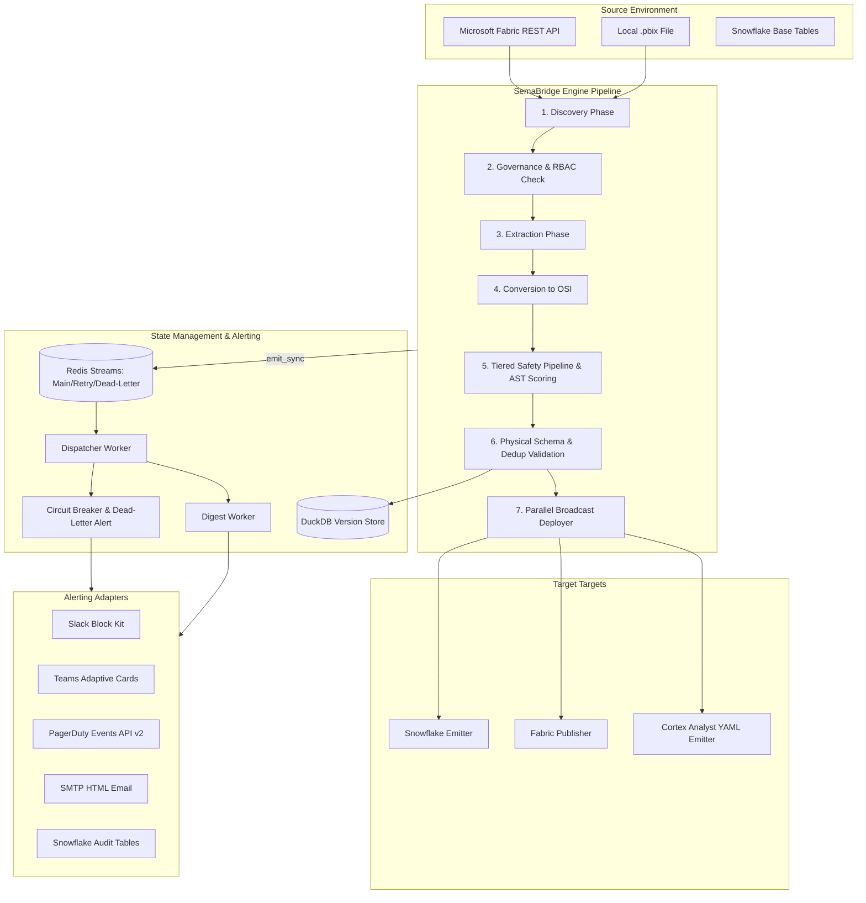

# 🌉 Semabridge Implementation & Architecture Manual

This document provides a highly technical, end-to-end implementation and architectural reference for **Semabridge** (Snowflake ↔ OSI ↔ Fabric Semantic Model Pipeline). It serves as a self-contained guide for developers and AI agents to understand the system's runtime paths, data contracts, capabilities, failure modes, configurations, and roadmap.

---

## 1. End-to-End Workflow

Semabridge is a metadata synchronization platform designed to automate the translation, validation, version control, and deployment of enterprise semantic layers. It supports two primary execution pipelines depending on the context: a **Single Model/Dataset Execution Pipeline (via Core Engine)** and a **State-Tracked Bidirectional Sync Orchestrator Pipeline (`SyncOrchestrator`)**. Both pipelines converge around a unified intermediate representation: **Open Semantic Intermediate (OSI)**.

### 1.1 Architectural Architecture Overview



---

### 1.2 Execution Pipeline Modes

#### A. Single Model/Dataset Execution Pipeline (Core Engine)
The core engine (`SemaBridgeEngine`) implements a **One Source, Many Targets** broadcasting architecture, allowing a single extracted source model to be converted and deployed to multiple physical target locations in parallel:

1. **Discovery Phase:** Scans the source repository (e.g. Fabric workspace or local folders) for model candidates matching wildcards or glob patterns. Evaluates inclusion/exclusion criteria.
2. **Governance Check (RBAC Validation):** Connectors test their authentication keys and verify role privileges (e.g. read access to source metadata, write access to target database schemas) to fail early and save processing costs.
3. **Extraction Phase:** Downloads the raw metadata (e.g., Fabric TMSL JSON, or PBIX binary streams). Uses a `ThreadPoolExecutor` (default limit: `5` concurrent workers) to make parallel REST API calls.
4. **Conversion Phase:** Converts raw vendor-specific representations to the vendor-neutral `OSIModel` representation. Processes small batches sequentially, and larger batches concurrently via `ThreadPoolExecutor` to avoid Pickling constraints.
5. **Tiered Safety Pipeline:** An AST analyzer scans DAX formulas to classify measures into complexity tiers (1 to 5) and generates YAML manual SQL override scaffolds for complex logic that cannot be deterministically translated.
6. **Physical Schema & Deduplication Validation:** Runs checks on the generated OSI structures:
   - **Name Deduplication:** Catches conflicts like `Regional_Sales_Sample` vs `Regional Sales Sample` before schema extraction.
   - **Structural Deduplication:** Identifies and de-duplicates identical tables, columns, and metric definitions that differ only by label.
7. **Parallel Broadcast Phase:** Deploys target artifacts. Deploys to targets in parallel via `ThreadPoolExecutor` (up to `10` target threads), but executes sequentially within each individual target connection to avoid DDL races. Evaluates target semaphores (limit: `5` connections per target type) for load shedding and bulkhead isolation.
8. **Cleanup & Finalize:** Persists snapshots, flushes OpenTelemetry metrics, and writes log events.

#### B. State-Tracked Bidirectional Sync Orchestrator (`SyncOrchestrator`)
The `SyncOrchestrator` manages continuous delta-synchronization between Fabric workspaces and Snowflake, using a 5-stage pipeline:

```
[EXTRACT] ──> [CONVERT] ──> [VALIDATE] ──> [TRANSFORM] ──> [EMIT]
```

1. **Job Initialization:** Creates a unique `SyncJob` inside the database, discovers individual source items (tables/models), commits them as `SyncJobItem` rows, and publishes a `Sync Started` event.
2. **Sequential or Parallel Execution:** For each item:
   - **Extract:** Obtains source JSON/DDL and parses it into `OSIModel` representations.
   - **Incremental Gate:** Computes a unique schema hash of the active model and compares it against historical mappings in DuckDB. Skips deployment if hashes match.
   - **Conflict Detection:** Compares the source model's relationships, data types, and primary keys with the target schema. Halts execution or applies resolution strategies (e.g. `force`, `merge`) if conflicts are found.
   - **Schema Evolution Tracking:** Records schema versions and commits them to DuckDB tables to maintain deployment history.
   - **Deployment to Target:** Generates Snowflake Dynamic Tables, relational DDL columns, or Cortex Analyst YAML configurations, and executes the compile steps.
   - **Mapping Registration:** Commits a `ModelMapping` record, saving the execution status, timestamp, schema hash, and the operational `sync_mode` (e.g. `copy`, `upsert`).
3. **Finalization & Observation:** Commits final runtime logs to DuckDB, rolls back unsuccessful states if needed, pushes observability tables to Snowflake, and triggers downstream notifications.

---

### 1.3 Asynchronous Notification Pipeline

The notification pipeline operates completely out-of-band to guarantee that alert delivery failures never block the main semantic synchronization engine:

1. **Emission:** The sync engine creates a `NotificationEvent` (with bitmask severity levels: `SYNC_RESULT=1`, `CRITICAL=2`, `ERROR=4`, `WARNING=8`, `INFO=16`, `DEBUG=32`) and calls the non-blocking `emit_sync()` method.
2. **Ingress:** The service serializes the event and enqueues it to the Redis Stream `semabridge:notifications` (main delivery queue).
3. **Dispatcher Worker:** Consumes events from the main Redis Stream:
   - Evaluates **Advanced Routing Rules** based on levels, source pattern patterns, and payload parameters.
   - Applies **Deduplication Check** by generating an event fingerprint and checking against a Redis TTL window (default: `300` seconds).
   - Evaluates **Quiet Hours Windows:** If quiet hours are active for a channel (supporting cross-midnight windows and PEP 615 timezones), non-critical notifications are staged in the Redis cache `semabridge:digest-staging:{channel_id}` with a 24-hour TTL.
   - Verifies the **Circuit Breaker state:** Skip open channels to avoid resource exhaustion.
   - Formats the event via specific formatters (e.g., Slack Block Kit, Teams Adaptive Cards, PagerDuty Events v2 JSON) and submits it to the channel adapter.
   - On delivery failure, enqueues the event to the `semabridge:retry` stream.
4. **Retry Worker:** Consumes from `semabridge:retry`. Processes retries with exponential backoff (`5s` ➔ `30s` ➔ `120s`). If a message exceeds `3` attempts (configurable), it is sent to `semabridge:dead-letters`.
5. **Dead-Letter Worker:** Consumes from `semabridge:dead-letters`. Increments the channel's dead-letter failure counter (1-hour TTL). If failure count reaches `5` (configurable), the channel is auto-disabled (`notification_channels.status = 'DISABLED'`) in the DB, and critical alerts are broadcasted to all other healthy channels.
6. **Digest Worker:** Runs on a `60s` cron. When quiet hours end, it fetches staged events, groups them, and flushes a consolidated summary to the channel.

---

## 2. Core Components & Implementation

```
semabridge/
├── src/semabridge/
│   ├── core/            # Broadcast execution engine, config, environments, settings
│   │   ├── engine.py           # SemaBridgeEngine, TargetConnectorBase, SourceConnectorBase
│   │   ├── behavior.py         # Dynamic execution behavior configs
│   │   ├── settings.py         # Global settings loading & management
│   │   └── engine/
│   │       ├── context.py      # RunContext definition & state representation
│   │       └── finalize.py     # step7_persist_artifacts, step10_finalize, notify helpers
│   ├── connectors/      # Integrations, DDL generation, schemas
│   │   ├── fabric_extractor.py # Workspace metadata caching, REST client, TMSL parser
│   │   ├── snowflake_emitter.py# dynamic table DDL builder, observability syncing
│   │   ├── schema_manager.py   # Snowflake connection pools, DDL executions
│   │   ├── ddl_builder.py      # Snowflake view compilation, relationships, comments
│   │   ├── measure_sync.py     # _SEMANTIC_MEASURES tracking table sync
│   │   └── local_pbix_connector.py # Local PBIX ZIP parsing, M expression extraction
│   ├── converter/       # Parsers, compilers, AST mappings
│   │   ├── dax_ast_parser.py   # Lexer, recursive-descent parser, AST structures
│   │   ├── dax_translator.py   # Deterministic translation rules & compiler pipelines
│   │   ├── gemini_dax_translator.py # Gemini LLM fallback provider
│   │   └── safety_pipeline.py  # Safety validations & auto-override scaffolders
│   ├── repository/      # State management, snapshot tracking, rollback DDL
│   │   ├── duckdb_manager.py   # SQLite-compatible DuckDB schema migrator
│   │   ├── model_repository.py # commit_model, SnapshotRow ORM models, version tracking
│   │   └── rollback_orchestrator.py # Snapshot restore controller with sync_mode parsing
│   └── notifications/   # Non-blocking async event pipeline
│       ├── services/           # quiet_hours_service, circuit_breaker_service
│       ├── adapters/           # slack, teams, pagerduty, email, snowflake_audit
│       └── workers/            # dispatcher, retry, dead_letter, digest cron
```

### 2.1 Core Engine (`src/semabridge/core/`)

- **`SemaBridgeEngine`:** Coordinates discovery, governance, extraction, conversion, validation, and target broadcasts.
  - *Bulkhead Isolation:* Stores thread execution pools and limits target connections via `self._target_semaphores`.
  - *Load Shedding:* Acquires semaphores per target with a 30-second timeout. Drops the deployment thread on timeout.
- **`RunContext` (`core/engine/context.py`):** Acts as the thread-safe state container. Shares runtime tokens, SML/OSI configurations, timing metrics, and error collections across pipeline steps.
- **`finalize.py` (`core/engine/finalize.py`):** Handles cleanup and final logging:
  - *`_step7_persist_artifacts`:* Commits the current SML/OSI models to DuckDB, saving snapshots along with their operational `sync_mode` (copy vs upsert).
  - *`_step10_finalize`:* Emits "Sync Completed" notifications on success, and logs structured failure details on execution crashes.

---

### 2.2 Integrations & Connectors (`src/semabridge/connectors/`)

- **`FabricExtractor`:** Fetches metadata from Fabric via AAD Token Management:
  - Implements workspace GUID resolution and caches semantic models to reduce API load.
  - Downloads model metadata using the `/workspaces/{id}/semanticmodels/{id}/definition` endpoint.
- **`SnowflakeEmitter`:** Manages schema deploys and validation checks:
  - *Schema Validation Check:* Compares generated structures with existing tables to prevent silent data loss or destructive type alterations.
  - *Missing Base Tables:* If compilation fails due to a missing base table, it logs a warning instead of failing the sync job, allowing semantic models to be created ahead of physical migrations.
- **`SemanticViewBuilder` (`ddl_builder.py`):** Compiles physical schemas into Snowflake views or Dynamic Tables.
  - Builds dynamic join graphs from relationship attributes (supports multi-column keys).
  - Configures dynamic attributes (e.g. `TARGET_LAG = '1 day'`, `WAREHOUSE = 'COMPUTE_WH'`).
- **`MeasureSynchronizer` (`measure_sync.py`):** Maintains the `_SEMANTIC_MEASURES` tracking table inside the target database schema, recording original DAX expressions, target SQL compilations, and complexity scores.
- **`LocalPBIXConnector`:** Reads local `.pbix` ZIP archives to extract `model.bim` partitions and extracts M expressions.

---

### 2.3 DAX Translation & Compilation (`src/semabridge/converter/`)

Translates DAX formulas to equivalent SQL expressions using a **5-tier deterministic translation pipeline**:

```
[Tier 1: Direct Mapping] ➔ [Tier 2: Conditional/Arithmetic] ➔ [Tier 3: Time Intelligence] ➔ [Tier 4: Context Filters] ➔ [Tier 5: LLM Fallback]
```

#### A. Lexing & Parsing (`dax_ast_parser.py`)
Implements a recursive-descent lexer and parser. Translates DAX code into AST node hierarchies:

```python
class DaxAstNode: pass
class FunctionCallNode(DaxAstNode):
    name: str
    args: List[DaxAstNode]
class ColumnRefNode(DaxAstNode):
    table_name: Optional[str]
    column_name: str
class MeasureRefNode(DaxAstNode):
    measure_name: str
class BinaryOpNode(DaxAstNode):
    left: DaxAstNode
    operator: str
    right: DaxAstNode
```

#### B. Translation Tiers (`dax_translator.py`, `gemini_dax_translator.py`)

- **Tier 1 (Direct Mappings):** Maps aggregate functions directly (`SUM` ➔ `SUM`, `AVERAGE` ➔ `AVG`, `DISTINCTCOUNT` ➔ `COUNT(DISTINCT)`).
- **Tier 2 (Arithmetic & Control Flow):** Translates math calculations, conditionals, and logical wrappers:
  - Maps `DIVIDE(A, B)` to null-safe `DIV0(A, B)`.
  - Translates `IF(cond, val1, val2)` and `SWITCH` to SQL `CASE WHEN` blocks.
- **Tier 3 (Time Intelligence):** Translates time aggregates to SQL window functions using partitions:
  - Translates `TOTALYTD(SUM([Amount]), Date[Date])` to:
    ```sql
    SUM(Amount) OVER (
        PARTITION BY YEAR(Date) 
        ORDER BY Date 
        ROWS BETWEEN UNBOUNDED PRECEDING AND CURRENT ROW
    )
    ```
  - Also maps `TOTALMTD` (partitioned by Year + Month) and `TOTALQTD` (partitioned by Year + Quarter).
- **Tier 4 (Context Filters):** Translates `CALCULATE` statements containing simple table modifiers:
  - Maps `CALCULATE(SUM([Sales]), FILTER(Geography, [Country]="US"))` to subqueries with `WHERE` clauses.
  - Translates `ALL(Table)` to `OVER ()` to clear active analytical partitions.
  - Translates `ALLEXCEPT(Table, Table[Col])` to `PARTITION BY Col` to limit filters to specific attributes.
- **Tier 5 (LLM Fallback):** For complex iterators (`SUMX`, `AVERAGEX`, `RANKX`, `EARLIER`, `USERELATIONSHIP`), the parser triggers an LLM agent (via Google Gemini, Anthropic Claude, or local Ollama) to translate the context-based logic into SQL.
- **`MeasureDependencyResolver`:** Resolves dependencies between measures, inlines metric definitions, and flags circular loops.

---

### 2.4 Persistence Layer (`src/semabridge/repository/`)

- **DuckDB Manager (`duckdb_manager.py`):** Configures and migrates local `semabridge.db` files.
- **Model Repository (`model_repository.py`):** Manages snapshots and schema versions:
  - Commits snapshot models to the `snapshots` database table, including the operational `sync_mode` ("copy" vs "upsert").
- **Rollback Orchestrator (`rollback_orchestrator.py`):** Executes rollbacks by loading target versions, resolving their original `sync_mode` from the metadata table, and redeploying the historical state to restore database parity.

---

### 2.5 Alerts & Notifications (`src/semabridge/notifications/`)

- **`QuietHoursService`:** Implements time-based notification suppression.
  - Supports overnight windows crossing midnight (e.g. `22:00-07:00`).
  - Uses `zoneinfo` database libraries to calculate UTC offsets and handle Daylight Saving Time (DST) spring-forward or autumn fall-back adjustments.
- **`DigestWorker`:** Periodically checks suppressed event queues (`semabridge:digest-staging:{channel_id}`), aggregates warning counts, and sends consolidated summaries.
- **`CircuitBreakerService`:** Manages delivery state flags in Redis (`semabridge:cb:{channel_id}:failures`, `cooldown_until`). Opens the circuit after 3 consecutive failures, blocking calls to downstream APIs during outages.
- **`DeadLetterWorker`:** Auto-disables channels that fail repeatedly and alerts operations team members.

---

## 3. Known Gaps & Limitations

While Semabridge is highly robust, developers must account for the following implementation gaps and architectural limitations:

### 3.1 Conversion & Parsing Gaps

| Feature | Severity | Description | Workaround |
| :--- | :--- | :--- | :--- |
| **M Query Translation** | **HIGH** | Power Query M expressions are extracted from PBIX partitions but not translated to SQL. Complex M transformations are lost. | Custom transformations must be manually created as Snowflake views before sync jobs run. |
| **Dynamic Row Contexts** | **MEDIUM** | Lacks a local semantic interpreter to execute dynamic row context variables (`EARLIER`, `EARLIEST`). | Falls back to LLM translation (introducing latency and non-deterministic risk). |
| **Row-Level Security (RLS)** | **HIGH** | RLS filters defined in Fabric or PBIX models are ignored during DDL compilation. | Snowflake Row Access Policies must be manually configured in the target schema. |
| **Dynamic Parameters** | **MEDIUM** | Runtime dataset arguments (e.g. dynamic date boundaries) cannot be resolved without a user session. | Bind parameters to static defaults or Snowflake dynamic query variables. |
| **Fiscal Calendars** | **LOW** | Time intelligence translations assume standard Gregorian calendars. | Fiscal year offsets must be manually handled via SQL overrides. |

### 3.2 Metadata & Lineage Gaps

- **Granular Lineage Tracking:** Lineage is defined only at the table level (relationship maps). Granular column-level lineage and measure formula tree diagrams are not supported.
- **Lost Precision in Formats:** Display format strings (e.g., custom currency partitions, dynamic decimals) are partially lost during SML conversion.
- **Implicit Relationships:** Auto-relationship detection may miss associations that lack explicit foreign keys in the source schema.

### 3.3 Scalability & Reliability Gaps

- **DuckDB File Locks:** DuckDB is an embedded engine. Concurrent writes from different CLI commands will block execution, requiring careful job scheduling.
- **LLM Rate Limits:** Large-scale semantic models with dozens of Tier 5 measures can hit LLM API rate limits, halting sync executions.
- **State Serialization Overhead:** Serializing large, complex schema objects can cause latency in large workspaces.

---

## 4. Breakdown Points & Failure Scenarios

This section outlines potential failure modes, their symptoms, root causes, and recovery procedures:

```
┌───────────────────────────────────────┬────────────────────────────────────────┬────────────────────────────────────────┐
│ Incident Scenario                     │ System Symptom                         │ Mitigation & Recovery Procedure        │
├───────────────────────────────────────┼────────────────────────────────────────┼────────────────────────────────────────┤
│ LLM API Outage                        │ - Tier 5 DAX compilation crashes       │ - Configure local LLM fallbacks       │
│                                       │ - Sync job status set to FAILED        │ - Create manual SQL overrides in SML   │
├───────────────────────────────────────┼────────────────────────────────────────┼────────────────────────────────────────┤
│ Redis Outage                          │ - Sync processes complete successfully │ - Alerts are stored in memory queues   │
│                                       │ - Notifications are completely lost    │ - Restart Redis and worker containers  │
├───────────────────────────────────────┼────────────────────────────────────────┼────────────────────────────────────────┤
│ DuckDB Database Lock                  │ - CLI operations abort immediately     │ - Wait for active CLI jobs to finish   │
│                                       │ - "Database locked" exception logged   │ - Clear stale lock files manually      │
├───────────────────────────────────────┼────────────────────────────────────────┼────────────────────────────────────────┤
│ Schema Mismatch                       │ - Target compilations fail             │ - Sync exits safely without data loss  │
│                                       │ - Warning emitted, deploy aborted      │ - Resolve structural differences first │
├───────────────────────────────────────┼────────────────────────────────────────┼────────────────────────────────────────┤
│ Circuit Breaker Opens                 │ - Alert channels set to DISABLED       │ - Check external service statuses      │
│                                       │ - Dispatcher worker skips delivery     │ - Reset the circuit breaker via API    │
└───────────────────────────────────────┴────────────────────────────────────────┴────────────────────────────────────────┘
```

---

## 5. Dependencies & Assumptions

### 5.1 System Dependencies

- **Runtime Environment:** Python `>= 3.10` and `< 3.13` (leveraging typing improvements, structural matching, and `zoneinfo` databases).
- **Embedded Database:** DuckDB (automatically managed via migration scripts).
- **Messaging Engine:** Redis `>= 6.2` (requiring Redis Streams support for `XADD`, `XACK`, and consumer groups).
- **Database Connectors:** `snowflake-connector-python` and `snowflake-sqlalchemy` for target query operations.
- **Data Validation:** `pydantic >= 2.0` for schema enforcement.
- **API Services:** FastAPI and Uvicorn for local backend routing.
- **Credentials Manager:** Access keys for Google Gemini or Anthropic Claude APIs when translating Tier 5 measures.

### 5.2 Environmental Assumptions

1. **Physical Parity:** Physical base tables (e.g. `ORDERS`, `CUSTOMERS`) must exist in the target database before semantic models are deployed.
2. **Access Control:** The running principal must have appropriate Snowflake schema and Dynamic Table creation privileges.
3. **Data Integrity:** Base calendars are assumed to contain contiguous dates for window functions to evaluate correctly.

---

## 6. Configuration & Deployment Details

### 6.1 Configuration Schema

Semabridge manages runtime execution behavior via three core YAML configuration files:

#### A. Global System Config (`Config/config.yaml`)
Defines connection settings and resource paths:
```yaml
database:
  path: "semabridge.db"
  timeout_ms: 5000

redis:
  url: "redis://localhost:6379/0"
  socket_timeout: 10

logging:
  level: "INFO"
  format: "json"
```

#### B. Pipeline Policy Config (`Config/behavior.yaml`)
Manages deployment policies and safety gates:
```yaml
deployment:
  allow_schema_drift: false
  fail_on_missing_tables: false # True: abort deployment; False: log warning and continue
  lag_default: "1 day"
  warehouse_default: "COMPUTE_WH"

concurrency:
  max_extraction_workers: 5
  max_conversion_workers: 4
  max_broadcast_workers: 10

safety_pipeline:
  block_on_override_required: false
  enforce_tiered_safety: true
```

#### C. Project Sync Configuration (`semabridge.yaml` or `Config/semabridge.yaml`)
Specifies source definitions, targets, and synchronization behaviors:
```yaml
source:
  type: fabric
  workspace_id: "7823ab12-c289-4912-88f1-e123490aa123"
  model: "Finance_Model_Production"

targets:
  - type: snowflake_semantic_view
    database: "PRODUCTION_DB"
    schema_name: "SEMANTIC_LAYER"
    deploy: true

model_name: "Finance_Model_Production"
version_tag: "v2.4.1"
sync_mode: "upsert" # Mode: copy (full overwrite) or upsert (incremental updates)
```

---

### 6.2 Key Environment Variables

Create a local `.env` configuration file containing the following connection details:

```env
# Snowflake Credentials
SNOWFLAKE_ACCOUNT=your-account.region.gcp
SNOWFLAKE_USER=SEMABRIDGE_PIPELINE
SNOWFLAKE_PASSWORD=your-secure-password
SNOWFLAKE_WAREHOUSE=COMPUTE_WH
SNOWFLAKE_DATABASE=PRODUCTION_DB
SNOWFLAKE_SCHEMA=SEMANTIC_LAYER

# Microsoft Fabric Identifiers
FABRIC_TENANT_ID=your-azure-tenant-guid
FABRIC_CLIENT_ID=your-app-registration-id
FABRIC_CLIENT_SECRET=your-app-registration-secret
FABRIC_WORKSPACE_ID=your-workspace-guid

# Redis Messaging Service
REDIS_URL=redis://localhost:6379/0

# LLM Fallback Translators
GEMINI_API_KEY=your-gemini-token
CLAUDE_API_KEY=your-anthropic-token

# Notification Operational Variables
NOTIFICATION_DEDUPE_TTL_SEC=300
CIRCUIT_BREAKER_THRESHOLD=3
DEAD_LETTER_ALERT_THRESHOLD=5
```

---

### 6.3 Deployment & Execution Guide

#### A. Running Locally for Development

1. **Install Dependencies:**
   ```bash
   # Sync dependencies via uv
   uv sync
   ```
2. **Apply Database Migrations:**
   ```bash
   # Run the custom cross-platform PowerShell migration helper
   .\dev.ps1 migrate
   ```
3. **Validate Connection Configurations:**
   ```bash
   # Run the integration health validator
   semabridge validate
   ```
4. **Execute Synchronizations:**
   ```bash
   # Start the bidirectional synchronization job
   semabridge semantic sync
   ```
5. **Launch the User Interface:**
   ```bash
   # Run the stream lit server interface
   semabridge --ui
   ```

#### B. Production Setup

In production, run the sync engine and notification workers as separate microservices using Docker Compose:

```yaml
version: '3.8'
services:
  redis:
    image: redis:7-alpine
    restart: always
    ports:
      - "6379:6379"

  sync-engine:
    build: .
    command: python -m semabridge.cli semantic sync
    environment:
      - REDIS_URL=redis://redis:6379/0
    env_file:
      - .env
    depends_on:
      - redis

  dispatcher-worker:
    build: .
    command: python -m semabridge.notifications.workers.dispatcher
    environment:
      - REDIS_URL=redis://redis:6379/0
    env_file:
      - .env
    depends_on:
      - redis

  digest-worker:
    build: .
    command: python -m semabridge.notifications.workers.digest_worker
    environment:
      - REDIS_URL=redis://redis:6379/0
    env_file:
      - .env
    depends_on:
      - redis
```

---

## 7. Next Steps & Recommendations

To improve system robustness, reliability, and performance, prioritize the following enhancements:

### 7.1 Deterministic Translation Mappings
- **Expand Deterministic Mappings:** Expand deterministic translations to cover common iterators (e.g. `SUMX`, `AVERAGEX`) when they contain simple filters. This will reduce dependency on external LLM services and lower processing latency.
- **Variables & Variables Parser:** Build a variable parser to parse and inline complex nested `VAR` statements before translating expressions.

### 7.2 Security Hardening
- **AES-256 Secret Management:** Implement dynamic key rotation for encryption keys stored in config files, and integrate with vaults (e.g., Azure Key Vault or AWS Secrets Manager).
- **Sanitized Jinja2 Sandboxing:** Review the Jinja2 template sandboxing configuration to ensure safe rendering of user-supplied HTML notifications.

### 7.3 Performance Optimizations
- **Incremental DDL Migrations:** Instead of executing full `CREATE OR REPLACE` commands for views, implement alter-only schema updates to avoid dropping targets.
- **Cache-Control Mappings:** Implement a local cache mapping compiled expressions to their original DAX strings, avoiding redundant LLM API calls.

### 7.4 Observation & UI Integration
- **OpenTelemetry Instrumentation:** Instrument connectors, engines, and workers with OpenTelemetry spans to track performance and bottlenecks.
- **Admin Settings Dashboard:** Integrate channel configuration, log viewing, and manual overrides directly into the Vite/React dashboard.
